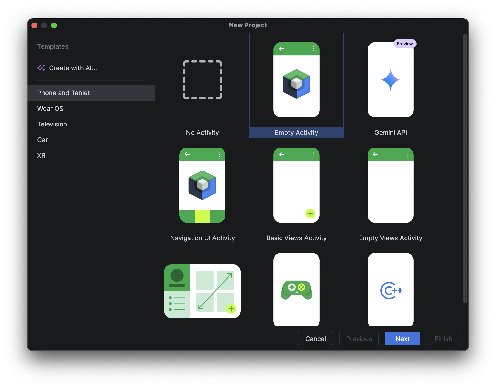
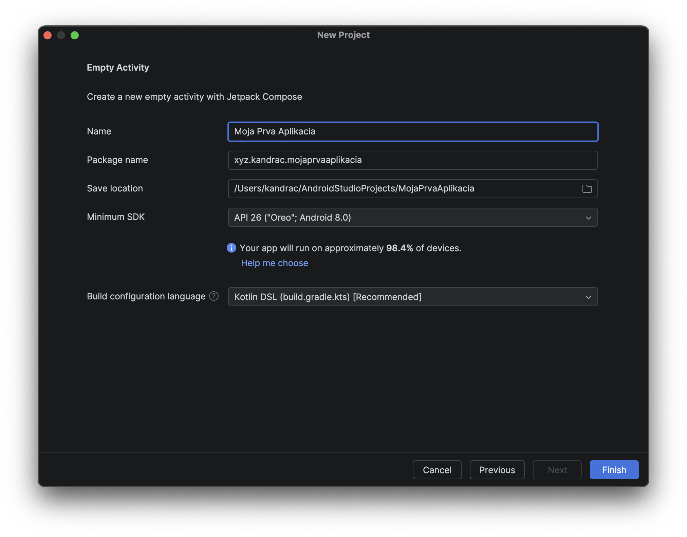

# 0.2 Vytvorenie prázdneho projektu

1. Na úvodnej obrazovke zvoľ **New Project**
2. Ak sa ti úvodná obrazovka nezobrazí (lebo sa ti otvorí skôr vytvorený projekt), tak **File > New > New Project...**
3. Zvoľ **Empty Activity**
4. Nastav **Názov projektu** - obvykle názov aplikácie ako sa zobrazí v tvojom telefóne (dá sa neskôr zmeniť)
5. Nastav **Package name** - obvykle doména prvého rádu + doména druhého rádu + názov app, napr `xyz.kandrac.ssnd_appka`
6. Nastav **Minimum SDK** - teda akú najstaršiu verziu Androidu budeš podporovať, odporúčam **26+**
7. Stlač Finish

V podstate by si mal prejsť týmito dvoma obrazovkami:

