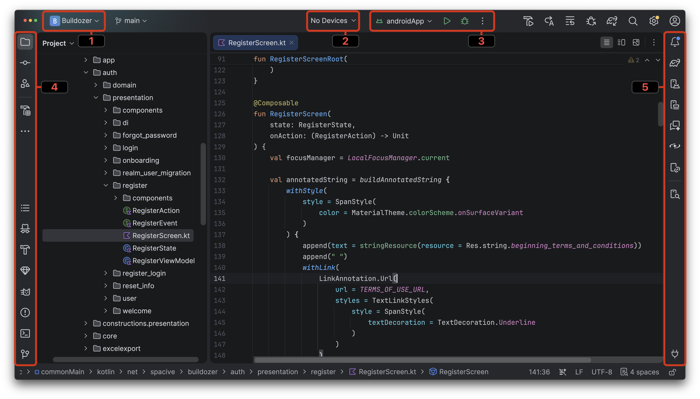

# 1.1 Prehľad Android Studia

My už poznáme prostredie IntelliJ Idea, na ktorom je Android Studio postavené, preto oboznamovanie sa s týmto prostredím
nemusí byť až taký problém. Po otvorení projektu uvidíme okno, ktoré môže vyzerať nasledovne:

Niektoré časti som schválne označil, aby sme sa nad nimi pozastavili:

1. Názov aktuálneho projektu spojený s vyberátkom pre **Recent Projects** - teda s posledne otvorenými projektami
2. **Výber zariadenia** (reálne alebo emulátor) - pretože projekt nebeží priamo na tvojom počítači v príkazovom riadku
3. **Run configurations** + **Run mode** - čo konkrétne (run cofiguration) a ako (run, debug, profile) chceš spustiť
4. **Toolbar 1** - výber rôznych nástrojov na projekt ako napríklad adresárová štruktúra, Git, či terminál
5. **Toobar 2** - výber ďalšieho setu nástrojov. Tu nájdeme menej používané nástroje ako Device Manager, alebo nástroje umelej inteligencie

## Klávesové skratky

Fungujú všetky klávesové skratky aké poznáš z IntelliJ Idea. Chcem pripomenúť niektoré najpoužívanejšie:

1. **Double Shift** - otvorí menu na rýchle vyhľadávanie súborov, pluginov, či akcií
2. **CTRL + D** - duplikovať označený text. V prípade neoznačeného textu duplikuj aktuálny riadok
3. **TAB** - v prípade autocomplete, stlačenie klávesy **TAB** dopíše aktuálne odporúčaný text
4. **ENTER** - v prípade autocomplete má veľmi podobné správanie ako **TAB** s drobnými rozdielmi (vie prepísať nasledujúci text)
5. **CTRL + left click** - kliknutie na názov premennej, funkcie, triedy a pod. vás dostane do jej definície, alebo na miesto použitia
6. **SHIFT + F6** - premenovanie premennej, funkcie, súboru a pod. v celom projekte