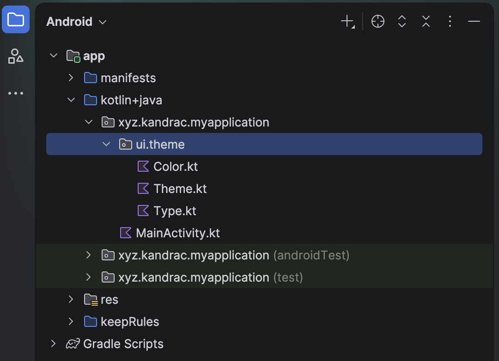

# 1.2 Nastavenie minimálneho projektu

Po vytvorení a otvorení projektu by si mal automaticky vidieť otvorený súbor `MainActivity.kt` a v ňom funkciu
`onCreate`. Je to funkcia, ktorá má za úlohu po spustení zobraziť prvú obrazovku. A vlastne táto funkcia zobrazuje
úplne všetky obrazovky. Ale o tom potom.

Túto funkciu vieme upraviť tak, aby robila len absolútne minimum. Zobraziť jednoduchý text bez akéhokoľvek štýlovania:

```kotlin
override fun onCreate(savedInstanceState: Bundle?) {
    super.onCreate(savedInstanceState)
    setContent {
        Text("Hello World")
    }
}
```

Tento kód znamená:
1. Po spustení aplikácie (`onCreate`)
2. Na obrazovke zobraz (`setContent`)
3. Text _Hello World_ (`Text("Hello World")`)

Tento kód je dostatočný, preto môžeš odstrániť

1. funkciu: `fun Greeting` v `MainActivity.kt`
2. funkciu: `fun GreetingPreview` v `MainActivity.kt`
3. a celú zložku `ui.theme`, ktorá sa stará o štýlovanie aplikácie
4. môžeš tiež odstrániť `test` a `androidTest` moduly

`ui.theme` nájdeš tu:


## Troubleshooting

Začiatky vedia byť náročné. Pre troubleshooting odporúčam použiť LLM, ktoré ťa navedú k riešeniu. Klasické problémy sú:

### 1 `Text` je červený alebo podčiarknutý

Funkciu `Text` musíš volať z balíka `androidx.compose...` rovnako ako aj všetky ostatné funkcie kreslenia
(tzv. **"Composable"** funkcie).

Riešenie:
1. preskroluj sa k importom,
2. ak tam neuvidíš `import androidx.compose.material3.Text`, tak ho pridaj,
3. ak uvidíš iný `import` s koncovkou `Text` (klasicky `import org.w3c.dom.Text`) odstráň ho.

> **Tip1**: Nezabudni, že ak v Android Studio niečo píšeš a vyskočí ti nejaký autocomplete, tak pomocou <kbd>Enter</kbd>
> alebo <kbd>Tab</kbd> ho vieš akceptovať. Takéto akceptovanie autocomplete zároveň správne vyrieši aj importy

> **Tip2**: Ak si zabudol pridať import, nerob to manuálne! Nabehni kurzorom na kód, ktorý vyžaduje import (`Text`) a
> stlač <kbd>Alt</kbd> + <kbd>Enter</kbd>

### 2 Ak nedokážeš spustiť aplikáciu, ale v kóde nie sú chyby #1

Nesmieš zmeniť `package` v prvom riadku súboru `MainActivity.kt`. Ak sa tvoj `MainActivity.kt` súbor nachádza v
`ssnd.student.appka`, potom zrejme aj `package` musí mať hodnotu:

```kotlin
package ssnd.student.appka
```

Ak chceš mať úplnú istotu
1. otvor si `app/build.gradle.kts` a v sekcii `android {}` hľadaj `namespace`.
2. otvor si `Manifest.xml` a v elemente `activity` hľadaj atribút `android:name`. Bodka znamená `package <namespace>` z
`build.gradle.kts`. Všetko za bodkou je relatívna adresa k aktivite, ktorá sa má spustiť.

### 3 Ak nedokážeš spustiť aplikáciu, ale v kóde nie sú chyby #2

Ďalšia možnosť je, že **New Project Wizard** vygeneroval nesprávne `build.gradle.kts` súbor. To spoznáš podľa chybovej
hlášky:

> Dependency '???' requires libraries and applications that depend on it to compile against version 37 or later of the Android APIs.

Hláška popisuje aj, ako treba problém vyriešiť:

> Recommended action: Update this project to use a newer compileSdk of at least 37, for example 37.1.

1. Otvor `app/build.gradle.kts` a zmeň `compileSdk` na odporúčanú verziu. V mojom prípade nasledovne:
```kotlin
compileSdk {
    version = release(37) {
        minorApiLevel = 1
    }
}
```
2. odporúčam zmeniť aj `targetSdk` na rovnakú verziu ako `compileSdk`.