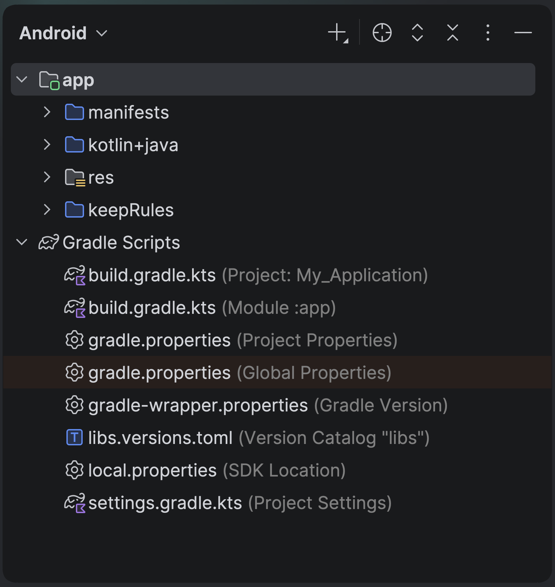

# 1.2 Súborová štruktúra

V Projektovom prehľade môžeš po vytvorení projektu vidieť štruktúru súborov podobnú tejto:

1. **Android** - v hornej lište znamená, že sa na projekt pozeráme z pohľadu Androiďáka. Niektoré súbory nám môžu byť skryté.
Tento prehľad obvykle prepínam na **Project**, aby som videl všetky súbory. Pre účely tohto kurzu stačí používať **Android**.
2.  - je ikona ktorú klikáme, keď máme otvorený nejaký súbor a chceme ho lokalizovať v štruktúre súborov.
3. Zložka **manifests** - obsahuje súbor `AndroidManifest.xml`, ktorý "predstavuje" tvoju aplikáciu tvojmu telefónu. Teda definuje ikonu a názov aplikácie, alebo čo sa spustí ako prvé po kliknutí na Launcher ikonu.
4. Zložka **kotlin + java** - obsahuje zdrojové súbory aplikácie. Všetok spustiteľný kód aplikácie budeme pchať sem.
5. Zložka **res** - obsahuje obrázky, fonty, preklady aplikácie a ďalšie pomocné súbory.
6. Zložka **keepRules** - obsahuje pravidlá pre obfuskáciu. Nebudeme ju používať
7. `build.gradle.kts (Project)` - je koreňový Gradle súbor. Nebudeme ho používať
8. `build.gradle.kts (Module)` - je Gradle súbor pre náš hlavný modul. Tu budeme pridávať závislosti na pluginoch a knižniciach. Zároveň tu konfigurujeme releasy našej aplikácie, spôsoby jej podpisovania a ďalšie.
9. `libs.versions.toml` - obsahuje verzie knižníc, ktoré používame v projekte. Sem-tam si ho otvor a aktualizuj podčiarknuté verzie.
10. `local.properties` - obsahuje lokálne nastavenia projektu, výlučne pre tvoj počítač.

## Čo nastaviť

1. Určite si otvor `libs.versions.toml` a aktualizuj všetko, čo sa dá - tento krok opakuj cca každý mesiac.
2. Ak si projekt ukladáš do gitu, otvor `.gitignore` súbor (vidíš ho len v **Project** prehľade, alebo cez double <kbd>Shift</kbd>). Nahraď všetky riadky začínajúce s `/.idea/...` jediným `/.idea`
3. Otvor si `app/build.gradle.kts (Module)` a aktualizuj `compileSdk.version` aj `targetSdk.version` na najnovšiu verziu. Release sú spomenuté na [oficiálnej stránke](https://developer.android.com/about/versions), ale riadiť sa budeš musieť sťažnosťami Android Studia.
4. Ak to s programovaním Android alebo Kotlin Multiplatform aplikácií myslíš vážne, používaj **Project** prehľad (pozri prvý bod kapitoly 1.2).
