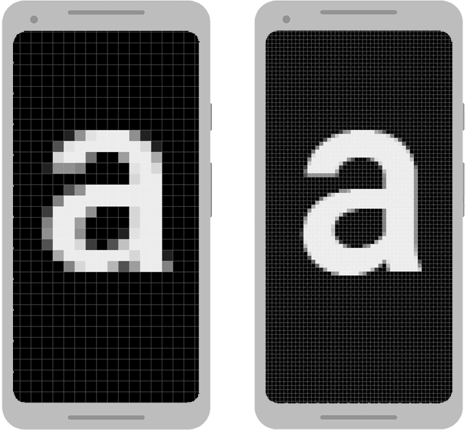

# 2.1 Composable funkcia `Text`

Poďme na to. `Text` si už použil v `MainActivity.kt` ako svoj prvý widget pre zobrazenie jednoduchého textu.

`Text` samotný má ale obrovské množstvo atribútov pre nastavenie jeho vzhľadu so zvláštnymi typmi parametrov.
Tu je nekompletný zoznam najčastejších:

- `text : String` - text, ktorý sa má zobrazovať
- `color : Color` - farba textu
- `fontSize : TextUnit` - veľkosť textu
- `fontWeight : FontWeight` - aký hrubý je text
- `fontStyle : FontStyle` - kurzíva textu
- `textAlign : TextAlign` - zarovnanie textu
- `lineHeight : TextUnit` - výška riadku
- `letterSpacing : TextUnit` - medzera medzi písmenami

Asi rovno ukážem príklad použitia `Text` funkcie:

```kotlin
// vynechany package + dalsie importy

import androidx.compose.material3.Text
import androidx.compose.ui.graphics.Color
import androidx.compose.ui.text.font.FontWeight
import androidx.compose.ui.text.style.TextAlign
import androidx.compose.ui.unit.sp

class MainActivity : ComponentActivity() {
    override fun onCreate(savedInstanceState: Bundle?) {
        super.onCreate(savedInstanceState)
        setContent {
            Text(
                text = "Hello World!",
                color = Color(0xFF000000),
                fontSize = 24.sp,
                fontWeight = FontWeight.SemiBold,
                textAlign = TextAlign.Center,
                lineHeight = 32.sp,
                letterSpacing = 1.sp,
            )
        }
    }
}
```

Všimnime si zopár vecí:
1. Všetky atribúty sú buď jednoduché typy (napr. `String` v prípade atribútu `text`), alebo typy z balíka `androidx.compose`
2. Pri použití `Text` som všetky atribúty označil názvom (tzv. named parameters), pretože `Text` ich má asi 20 a nie je šanca zapamätať si ich poradie.
3. Veľkosti pri `Text`-e sa označujú číslom s jednotkou `sp` (scale-independent pixels)

## Scale independent pixels

Na PC sme zvyknutí, že veľkosť textu nastavujeme ako priamu hodnotu, napríklad `12`. Táto veľkosť textu zaručuje jediné,
ak tento text vytlačíš na papier, bude mať rovnakú fyzickú veľkosť bez ohľadu na počítač, papier alebo tlačiareň, ktorú
použiješ.

Keďže nás ale nezaujímajú pixely na papiery, ale na reálnej obrazovke, stretávame sa s dvoma kritickými problémami:
1. **rozlíšenie** (DPI/dots per inch) - **12px** text na obrazovke so 100DPI sa bude 2x väčší ako na obrazovke s 200DPI
2. **nastavenie** zväčšenia písma - v nastaveniach telefónu používateľ môže nastaviť, že chce písmo 2x väčšie ako normálne

Preto nám klasické pixely nestačia. Pre približnú predstavu o bode 1 prikladám nasledovný obrázok:



`24.sp` bude pre náš kód znamenať nasledovné:
1. pri obrazovke s normálnym rozlíšením vynásob `24` číslom `1`. Pri dvojnásobnom rozlíšení vynásob `24` číslom `2`.
2. pri nastavení zväčšenia písma `1.5x` v telefóni vynásob `24` číslom `1.5`.

## DPI scales

Pre rýchlu predstavu o podporovaných rozlíšeniach. Základným rozlíšením je rozlíšenie **mdpi**. Relatívne rozlíšenia sú:

| Rozlíšenie | Násobiteľ oproti MDPI |
|------------|-----------------------|
| mdpi       | 1x                    |
| hdpi       | 1.5x                  |
| xhdpi      | 2x                    |
| xxhdpi     | 3x                    |
| xxxhdpi    | 4x                    |

V dizajnoch (napr. vo Figme) dizajnéri - často nevedomky - vždy používajú **mdpi** ako základný rozlíšenie. Preto môžeš
s veľkou dávkou istoty kopírovať priamo hodnoty veľkostí z dizajnu.