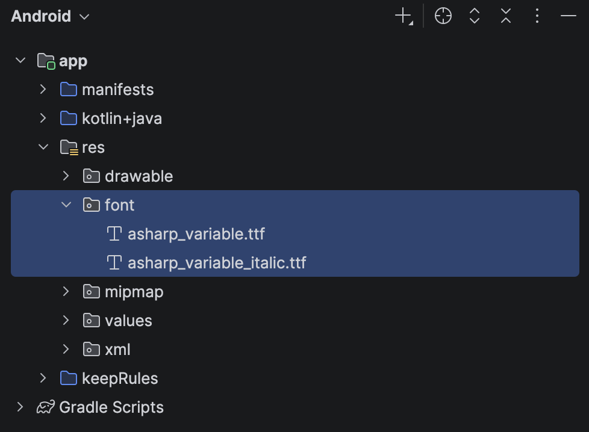
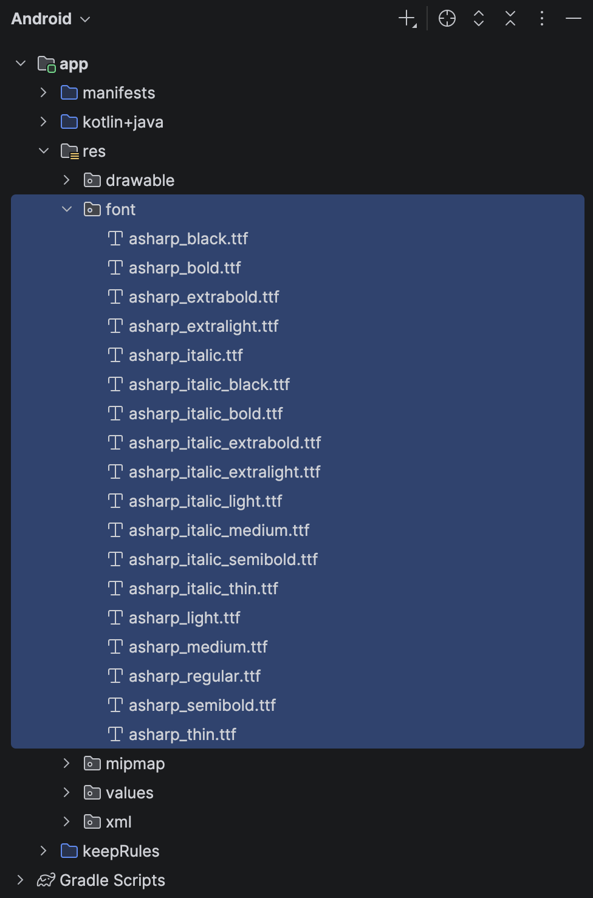

# 2.3 Fonty

`Text` poskytuje aj atribút `fontFamily: FontFamily`. Nastavenie nového fontu je mierne konfiguračne náročné:

1. V zložke `res` vytvor zložku `font`
2. Do nej vlož font vo formáte `ttf` (JetPack Compose iné formáty fontov nepodporuje)
   - pozor na názov `ttf` súboru, ideálne je ak bude obsahovať len malé písmená a podtržníky. Čísla a iné špeciálne znaky sú "nebezpečné"
   - môžeš použiť variabilné fonty (obvykle 2 `ttf` súbory pre normálny a italic font)
   - môžeš použiť statické fonty (väčšie množstvo `ttf` súborov pre rôzne hrúbky a štýly fontov)
   - hrúbka fontu môže mať tieto úrovne: `Thin` (100), `ExtraLight` (200), `Light`(300) `Normal`(400) `Medium`(500)
`SemiBold`(600), `Bold`(700), `ExtraBold`(800), `Black`(900), teda 9 rôznych hrúbok + italic varianty môže znamenať
18 fontov
3. Vytvor `FontFamily` ako globálnu premennú pomocou `FontFamily` konštruktora. Ten prijíma viacero `Font` objektov,
každý namapovaný na konkrétny font súbor z bodu 2 pomocou `fontWeight` a `style`.

Ako má vyzerať adresárová štruktúra a ukážka vytvorenia `FontFamily` je ukázaná na nasledovných príkladoch.

### Ukážka - variabilný font



```kotlin
// AsapSharp font
val asharp = FontFamily(
    Font(R.font.asharp_variable, style = FontStyle.Normal),
    Font(R.font.asharp_variable_italic, style = FontStyle.Italic),
)
```

### Ukážka - statický font



```kotlin
// AsapSharp font
val asharp = FontFamily(
   Font(R.font.asharp_thin,              style = FontStyle.Normal, weight = FontWeight.Thin),
   Font(R.font.asharp_extralight,        style = FontStyle.Normal, weight = FontWeight.ExtraLight),
   Font(R.font.asharp_light,             style = FontStyle.Normal, weight = FontWeight.Light),
   Font(R.font.asharp_italic,            style = FontStyle.Normal, weight = FontWeight.Normal),
   Font(R.font.asharp_medium,            style = FontStyle.Normal, weight = FontWeight.Medium),
   Font(R.font.asharp_semibold,          style = FontStyle.Normal, weight = FontWeight.SemiBold),
   Font(R.font.asharp_bold,              style = FontStyle.Normal, weight = FontWeight.Bold),
   Font(R.font.asharp_extrabold,         style = FontStyle.Normal, weight = FontWeight.ExtraBold),
   Font(R.font.asharp_black,             style = FontStyle.Normal, weight = FontWeight.Black),
   Font(R.font.asharp_italic_thin,       style = FontStyle.Italic, weight = FontWeight.Thin),
   Font(R.font.asharp_italic_extralight, style = FontStyle.Italic, weight = FontWeight.ExtraLight),
   Font(R.font.asharp_italic_light,      style = FontStyle.Italic, weight = FontWeight.Light),
   Font(R.font.asharp_italic,            style = FontStyle.Italic, weight = FontWeight.Normal),
   Font(R.font.asharp_italic_medium,     style = FontStyle.Italic, weight = FontWeight.Medium),
   Font(R.font.asharp_italic_semibold,   style = FontStyle.Italic, weight = FontWeight.SemiBold),
   Font(R.font.asharp_italic_bold,       style = FontStyle.Italic, weight = FontWeight.Bold),
   Font(R.font.asharp_italic_extrabold,  style = FontStyle.Normal, weight = FontWeight.ExtraBold),
   Font(R.font.asharp_italic_black,      style = FontStyle.Italic, weight = FontWeight.Black),
)
```