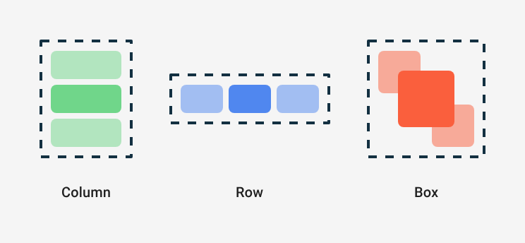

## 3.1 Prehľad Layoutov

Vo svete Androidu vieme komponenty (napríklad obrázok a text) umiestňovať vedľa seba, pod sebou, alebo prekrývajúc sa.
Existujú aj iné špeciálne layouty, ale tie potrebujeme len zriedka.



Pre lepšiu predstavu. Layout si vždy predstav ako adresárovú štruktúru. Do adresára môžeš vložiť nejaké súbory, ale aj
podadresáre. V závislosti od typu adresára, tento adresár rozumne zatriedi všetky súbory a podadresáre na obrazovku.

Pozrime sa napríklad na takéto rozloženie:

```txt
kontajner
├── komponent1
├── subkontajner
│   ├── komponent2
│   └── komponent3
└── komponent4
```

Ak by `kontajner` rozmiestňoval komponenty vedľa seba a `subkontajner` pod seba, výsledkom môže byť:


Ale ak by `kontajner` rozmiestňoval komponenty pod seba a `subkontajner` vedľa seba, výsledkom môže byť:


V tejto kapitole uvediem len prehľad najčastejších layoutov. V ďalších troch kapitolách si ich rozoberieme dopodrobna.

## Column - ukážka

Ak si si v predchádzajúcich príkladoch vytvoril viacero `Text`-ov, všimol si si, že sa prekrývali v ľavom hornom rohu
obrazovky. Android - resp. JetPack Compose - totiž nevedel, akú predstavu máš o rozmiestnení textov ty. Ak by si chcel
komponenty umiestniť pod seba, použiješ `Column`.

Výsledok pre zložitejší layout môže vyzerať nasledovne:


## Row - ukážka

Ďalším layoutom je `Row`, ktorý umiestňuje elementy vedľa seba. Otvor si akúkoľvek aplikáciu a náznaky `Row` určite
nájdeš. Ja vyberám malý príklad:


## Box - ukážka

No a keď si sa poriadne zapozeral do ukážky `Row`, mohol si si všimnúť ikonu pre email. Tá obsahuje samotnú ikonu a
červený kruh označujúci notifikáciu. Tento sa môže no nemusí na ikone emailu nachádzať. Jedná sa o 2 komponenty, ktoré
sa navzájom prekrývajú. Vtedy použiješ layout s názvom `Box`.

