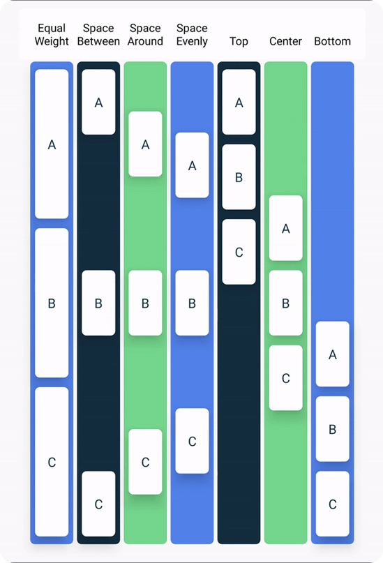

## 3.2 Column

`Column` umiestňuje komponenty pod seba.


Ak chceš umiestniť viacero textov pod seba, potrebuješ použiť Composable funkciu `Column`. V rámci `Column` vieš nastaviť viacero atribútov:

```kotlin
Column(
    modifier = Modifier.fillMaxSize(),
    verticalArrangement = Arrangement.Top,
    horizontalAlignment = Alignment.Start
) {
    // obsah stlpca
}
```

Treba pamätať na to, že `Column` sa snaží mať najmenšiu možnú veľkosť. Takže bez špeciálnych nastavení `verticalArrangement`
fungovať nebude vôbec (okrem `Arrangement.spacedBy()`) a `horizontalAlignment` iba podľa najširšej položky.

Takýmto špeciálnym nastavením je napríklad `Modifier.fillMaxSize()`, ktorý roztiahne `Column` na maximálnu možnú veľkosť.
Ak `Column` použiješ ako root tvojho UI, potom zaberie celú obrazovku. O ďalších nastaveniach veľkostí sa dozvieš v téme
Modifikátory.

Opis parametrov aj s vizualizáciou nájdeš vo videu, alebo bez vizualizácie tu:

### verticalArrangement

Rozmiestňuje (arrange) položky, ktoré vložíme ako obsah v rámci stĺpca:

- `Arrangement.Top` – predvolená hodnota, položky natlačí na seba a spolu ich zarovná hore
- `Arrangement.Center` – položky natlačí na seba a vertikálne ich spolu zarovná na stred
- `Arrangement.Bottom` – položky natlačí na seba a spolu ich zarovná dole
- `Arrangement.SpaceBetween` – vloží rovnaké, najväčšie možné medzery medzi položky
- `Arrangement.SpaceAround` – vloží rovnaké, najväčšie možné medzery medzi položky aj vrchný a spodný okraj `Column`
- `Arrangement.SpaceEvenly` – `Column` nastrihá na toľko rovnako veľkých častí, koľko je položiek. Každú položku v rámci svojej časti zarovná na stred
- `Arrangement.spacedBy(12.dp)` – položky budú zarovnané ako v prípade `Arrangement.Top`, ale medzi každou dvojicou položiek bude vložená medzera vysoká ako argument vstupujúci do tejto funkcie (`12.dp`)



### horizontalAlignment

`Column` má nejakú šírku. Ak je položka v stĺpci užšia ako šírka stĺpca, potom ju vieme horizontálne zarovnať (align):

- `Alignment.Start` – predvolená hodnota, položky budú zarovnané na začiatok riadku
- `Alignment.CenterHorizontally` – položky budú zarovnané na stred
- `Alignment.End` – položky budú zarovnané na koniec riadku

> **Tip**: Slovíčka Right a Left pri horizontálnom zarovnávaní, alebo podobných operáciách nepoužívame. Namiesto toho používame Start a End a to kvôli RtL jazykom (čítaných sprava doľava). Hebrejčina, Urdu, Arabčina, …
