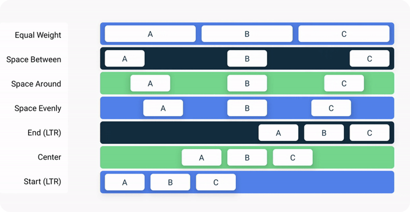

## 3.3 Row

`Row` umiestňuje položky vedľa seba.


Jeho použitie sa veľmi podobá `Column`:

```kotlin
Row(
    modifier = Modifier.fillMaxSize(),
    horizontalArrangement = Arrangement.Start,
    verticalAlignment = Alignment.Top
) {
    // obsah riadku
}
```

Treba pamätať na to, že `Row` sa snaží mať najmenšiu možnú veľkosť. Takže bez špeciálnych nastavení `horizontalArrangement`
fungovať nebude vôbec (okrem `Arrangement.spacedBy()`) a `verticalAlignment` iba podľa najvyššej položky.

Takýmto špeciálnym nastavením je napríklad `Modifier.fillMaxSize()`, ktorý roztiahne `Row` na maximálnu možnú veľkosť.
Ak `Row` použiješ ako root tvojho UI, potom zaberie celú obrazovku. O ďalších nastaveniach veľkostí sa dozvieš v téme
Modifikátory.

### horizontalArrangement

Rozmiestňuje (arrange) položky, ktoré vložíme ako obsah v rámci riadku:

- `Arrangement.Start` – predvolená hodnota, položky natlačí na seba a spolu ich zarovná na začiatok riadku
- `Arrangement.Center` – položky natlačí na seba a horizontálne ich spolu zarovná na stred
- `Arrangement.End` – položky natlačí na seba a spolu ich zarovná na koniec riadku
- `Arrangement.SpaceBetween` – vloží rovnaké, najväčšie možné medzery medzi položky
- `Arrangement.SpaceAround` – vloží rovnaké, najväčšie možné medzery medzi položky aj ľavý a pravý okraj riadku
- `Arrangement.SpaceEvenly` – `Row` nastrihá na toľko rovnako veľkých častí, koľko je položiek. Každú položku v rámci svojej časti zarovná na stred
- `Arrangement.spacedBy(12.dp)` – položky budú zarovnané ako v prípade `Arrangement.Start`, ale medzi každou dvojicou položiek bude vložená medzera široká ako argument vstupujúci do tejto funkcie (`12.dp`)



> **Tip**: Slovíčka Right a Left pri horizontálnom zarovnávaní, alebo podobných operáciách nepoužívame. Namiesto toho používame Start a End a to kvôli RtL jazykom (čítaných sprava doľava). Hebrejčina, Urdu, Arabčina, …

### verticalAlignment

`Row` má nejakú výšku. Ak je položka v riadku nižšia ako výška riadku, potom ju vieme vertikálne zarovnať (align):

- `Alignment.Top` – predvolená hodnota, položky budú zarovnané hore
- `Alignment.CenterVertically` – položky budú zarovnané na stred
- `Alignment.Bottom` – položky budú zarovnané nadol
