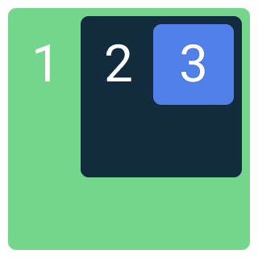
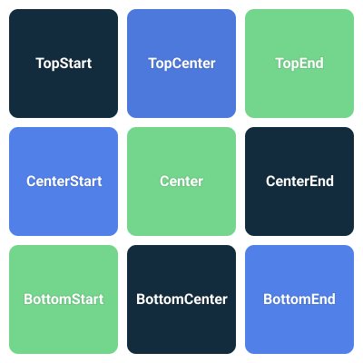

## 3.4 Box

Ak chceš umiestniť viacero textov tak, aby sa mohli aj prekrývať, potrebuješ použiť Composable funkciu `Box`.



V rámci `Box` vieš nastaviť viacero atribútov:

```kotlin
Box(
    modifier = Modifier.fillMaxSize(),
    contentAlignment = Alignment.TopStart,
    propagateMinConstraints = false
) {
    // obsah krabicky
}
```

Treba pamätať na to, že `Box` sa snaží mať najmenšiu možnú veľkosť. Takže bez špeciálnych nastavení `contentAlignment`
bude fungovať iba podľa najväčšej položky, ktorá sa v `Box` nachádza.

Takýmto špeciálnym nastavením je napríklad `Modifier.fillMaxSize()`, ktorý roztiahne `Box` na maximálnu možnú veľkosť.
Ak `Box` použiješ ako root tvojho UI, potom zaberie celú obrazovku. O ďalších nastaveniach veľkostí sa dozvieš v téme
Modifikátory.

Opis parametrov aj s vizualizáciou nájdeš vo videu. Alebo bez vizualizácie tu:

### `contentAlignment`

Zarovnáva (align) položky, ktoré vložíme ako obsah v rámci krabičky. Položky sa určite budú prekrývať:

- `Alignment.TopStart` – predvolená hodnota, všetky položky zarovná hore a na začiatok
- `Alignment.TopCenter` – všetky položky zarovná hore a horizontálne na stred
- `Alignment.TopEnd` – všetky položky zarovná hore a na koniec
- `Alignment.CenterStart` – všetky položky zarovná vertikálne na stred a na začiatok
- `Alignment.Center` – všetky položky zarovná na stred
- `Alignment.CenterEnd` – všetky položky zarovná vertikálne na stred a na koniec
- `Alignment.BottomStart` – všetky položky zarovná dole a na začiatok
- `Alignment.BottomCenter` – všetky položky zarovná dole a horizontálne na stred
- `Alignment.BottomEnd` – všetky položky zarovná dole a na koniec



### `propagateMinConstraints`

Mňa tento atribút nikdy netrápil a predpokladám, že nebude ani teba. V podstate len oznamuje každej položke v krabičke,
aká je minimálna veľkosť krabičky. Túto veľkosť následne vedia tieto položky zohľadniť v rámci layout fázy. Čo je téma
na dlhé lakte.

### Dodatok

Keďže viacero položiek sa bude pri `contentAlignment` prekrývať, je vhodné zarovnanie nastaviť každej položke zvlášť.
Content krabičky sa nachádza v takzvanom `BoxScope`, a preto každá z položiek vie použiť modifikátor `align(Alignment...)`.
Ukážku nastavenia tohto zarovnania nájdeš vo videu.

`Box` tiež vieme použiť, ak chceme zarovnať nejaký komponent, ktorý nepodporuje vertikálne alebo horizontálne
zarovnávanie (takmer všetky komponenty).