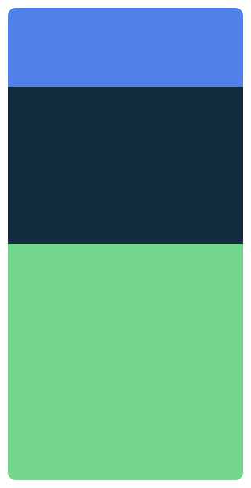

# 4.3 Scoped modifikátory

Niekedy máme k dispozícii aj modifikátory, ktoré bežne nevidíme. Všimni si napríklad, že ak do `setContent` vložíš
priamo `Text`, nemá k dispozícii modifikátor `weight`. Akonáhle ale do `setContent` vložíš `Row` alebo `Column` a
`Text` vložíš doň, zrazu sa modifikátor `weight` objaví.

## Zložitejšia teória

Je to preto, lebo vnútri `Row` alebo `Column` pracujeme s takzvaným `RowScope` alebo `ColumnScope`. Pozri sa napríklad
na definíciu funkcie `Column`:

```kotlin
@Composable
inline fun Column(
    modifier: Modifier = Modifier,
    verticalArrangement: Arrangement.Vertical = Arrangement.Top,
    horizontalAlignment: Alignment.Horizontal = Alignment.Start,
    content: @Composable ColumnScope.() -> Unit,
)
```

Výraz `ColumnScope.() -> Unit` znamená, že slovíčko `this` (ktoré nemusíme explicitne zapisovať) nám vráti objekt typu
`ColumnScope`. Vďaka tomu máme vnútri `Column` k dispozícii aj objekt `ColumnScope`, ktorý definuje nové modifikátory
`weight` a `align`.

## Modifikátor `weight`

Vďaka `ColumnScope` preto vieme zapísať niečo takéto:

```kotlin
Column(modifier = Modifier.fillMaxSize()) {
    Box(modifier = Modifier.weight(1f))
    Box(modifier = Modifier.weight(2f))
    Box(modifier = Modifier.weight(3f))
}
```

A vo výsledku (pri správnom použití veľkostí a farieb) uvidíme:



Modifikátor `weight` umožňuje nastaviť váhu komponentu v rámci `Row` alebo `Column`. Komponenty s vyššou váhou
vo výslednom layoute zaberú väčšiu časť dostupnej veľkosti.

### `weight(1f)`

V praxi často používame `weight(1f)` aby sme vyplnili zvyšok obrazovky bez nastavenia váh ostatným komponentom. Ukážem
len kúsky kódu s výsledkom:

```kotlin
Row {
    Image(/*...*/)
    Column(modifier = Modifier) {
        Text("Johny Bravo", /*...*/)
        Text("johny.bravo@gmail.com", /*...*/)
    }
    Image(/*...*/)
}
```

Výsledkom bude:


No a ak pridám `weight(1f)`:
```kotlin
Row {
    Image(/*...*/)
    Column(modifier = Modifier.weight(1f)) {
        Text("Johny Bravo", /*...*/)
        Text("johny.bravo@gmail.com", /*...*/)
    }
    Image(/*...*/)
}
```

Výsledkom bude:


## Modifikátor `align`

A ďalším scoped modifikátorom je modifikátor `align`, ktorý nám dovolí prekonať defaultné nastavenie
`horizontalAlignment` (v prípade `Column`) a `verticalAlignment` (v prípade `Row`). Hodnoty musia byť vytiahnuté z
`Alignment`.

```kotlin
Column {
    Text("Johny Bravo", modifier = Modifier.align(Alignment.CenterHorizontally))
    Text("johny.bravo@gmail.com", modifier = Modifier.align(Alignment.End))
}
```