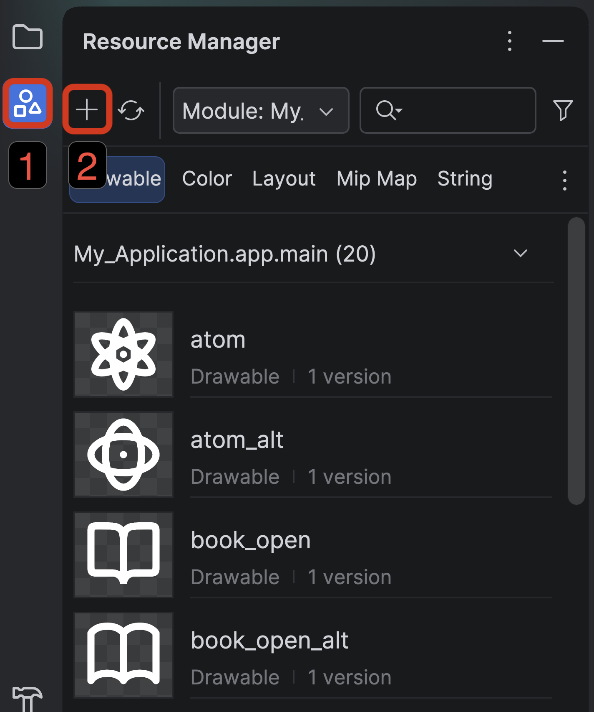
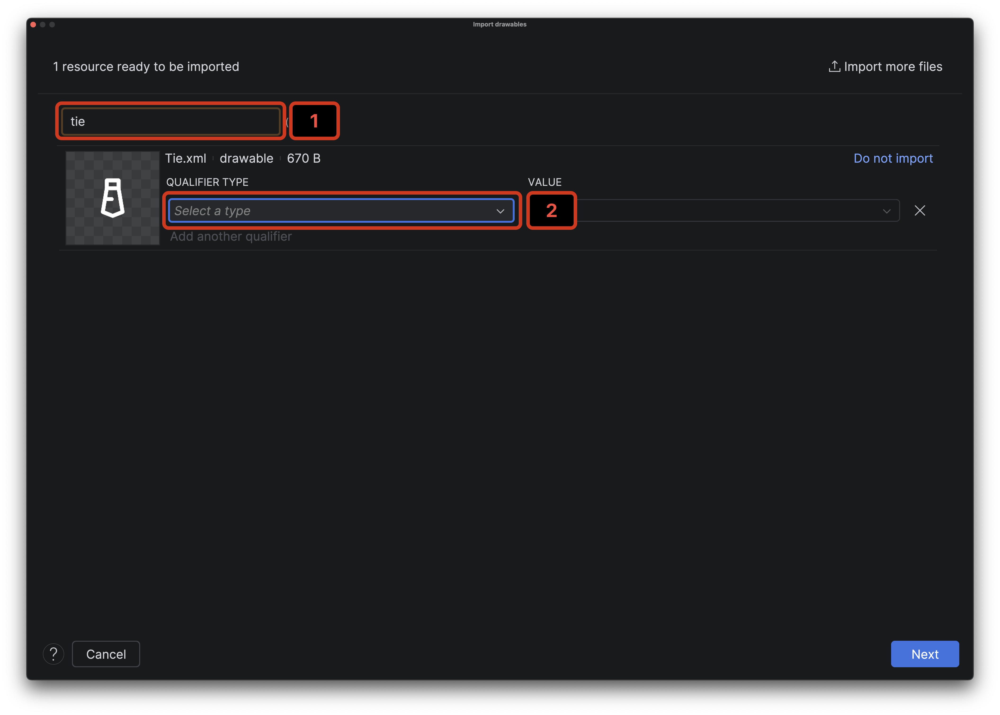

# 7.1 Vektorové obrázky

JetPack Compose samozrejme podporuje aj prácu s obrázkami. Najprv si ukážeme prácu s vektorovými obrázkami, ktoré sa
väčšinou používajú ako ikony. Prvý problém, ktorý musíme zvládnuť je import týchto obrázkov. **JetPack Compose** totiž
**nevie pracovať s formátom SVG**. Namiesto toho používa takzvané vector drawables vo formáte XML.

Android Studio ale má nástroje pre import SVG do vector drawables. Je ním Resource Manager, ktorý môžeš násť v ľavom
Toolbare pod ikonkou, ktorú som v obrázku označil číslom `1`:



> **Note:** Resource Manager je nástroj pre uľahčenie práce s resources (zdrojmi), medzi ktoré patria Obrázky, Farby,ä
> Preklady, Aplikácie, Fonty, Štýly a ďalšie. Ja osobne ho používam výlučne pre prácu s obrázkami.

Obrázky do svojho projektu môžeš importovať dvoma spôsobmi:
1. pomocou tlačidla <kbd>+</kbd> (označené číslom `2`) > Import Drawables
2. pomocou Drag & Drop z File Exploreru priamo do Resource Managera.

Oba spôsoby zobrazia takéto okno:



- Číslom `1` je označený názov importovaného súboru. V prípade ikon obvykle používame predponu `ic_` (napríklad `ic_home`).
- Číslom `2` je označený spinner pre výber kvalifikátora. Ten sa používa, ak chceme použiť iný vizuál ikony pre rôzne konfigurácie aplikácie.
Napríklad ikona reprezentujúca diakritiku môže vyzerať inak pre slovenčinu a inak pre poľštinu. Pri vektorových ikonách
kvalifikátory nezvykneme nastavovať.

Po importovaní obrázku ho môžeš nájsť v **Resource Manager**, pomocou double <kbd>Shift</kbd> alebo manuálne v zložke
`res/drawable` (v súborovej štruktúre je to `app/src/main/res/drawable`). Obrázok od tohto momentu môžeš v aplikácii
požívať podľa jeho názvu pred príponou `.xml` (napríklad `ic_home`).

## Composable funkcia `Icon`

Najtypickejšou formou použitia vektorov je ich použitie pomocou `Icon` Composable funkcie nasledovne:


```kotlin
import androidx.compose.material3.Icon

Icon(
    painter = painterResource(R.drawable.atom),
    modifier = Modifier.size(24.dp),
    tint = Color.White,
    contentDescription = null
)
```

- `painter` - obrázok, ktorý chceme zobrazovať - takmer výlučne používame funkciu `painterResource` s odkazom na obrázok pomocou `R.drawable.<nazov_obrazka>`
- `tint` - prefarbenie obrázku
- `contentDescription` - popis obrázku pre ľudí so zrakovým postihnutím. Môže byť `null` ak opísanie obrázka nie je dôležité.