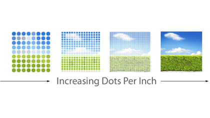
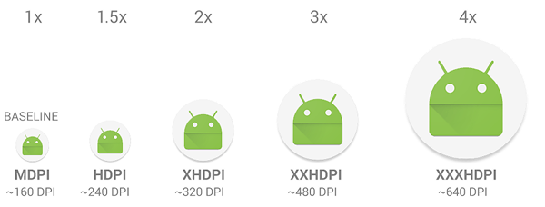
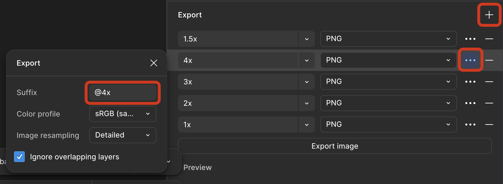
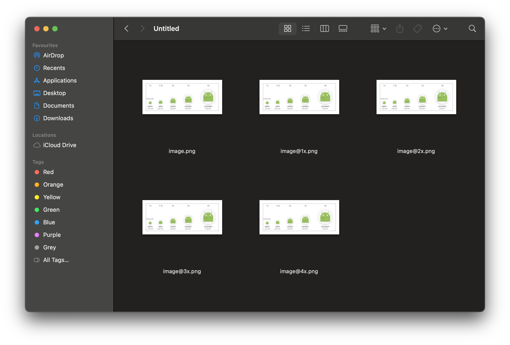
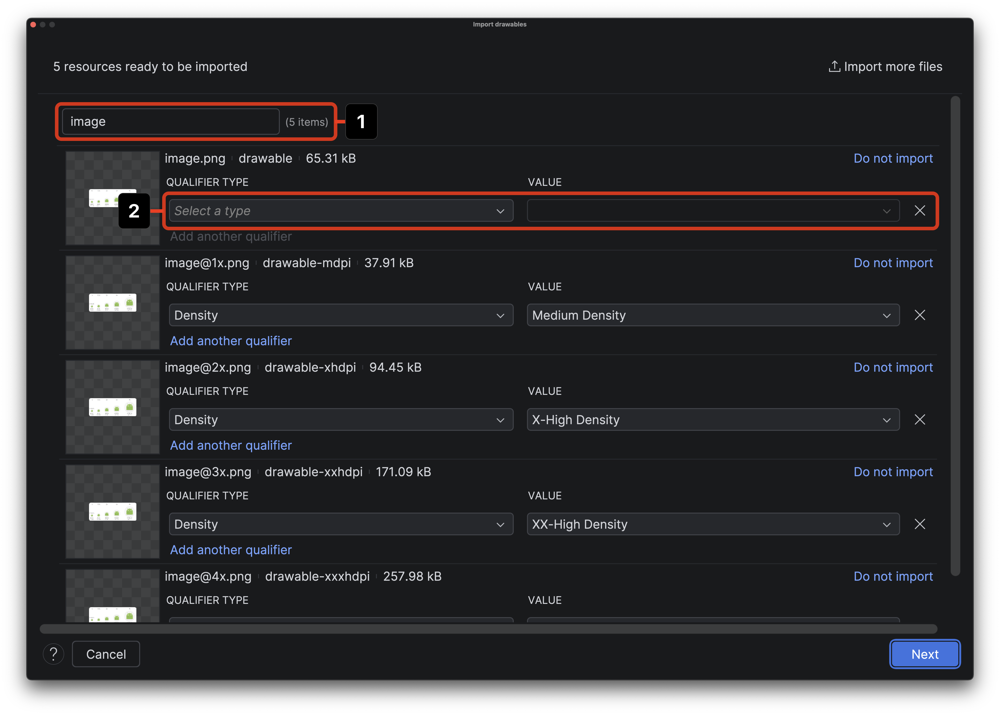

# 7.1 Rastrové obrázky

Import rastrových obrázkov je podobný ako v prípade vektorových obrázkov. Pri rastrových obrázkoch ale vyvstáva jeden
problém. Ak si spomínaš na jednotky `dp` a `sp`, tieto zohľadňovali rôzne DPI obrazovky. Zariadenie s veľkosťou
obrazovky 6" môže mať rozlíšenie `1080x1920` alebo `1440x2560` alebo aj `320x480`. Na všetkých týchto obrazovkách chceme
náš obrázok zobraziť najostrejší možný no nechceme ho mať zbytočne veľký.

Takže ak chcem zobraziť obrázok na celých 6" telefónu:
- pre telefón s rozlíšením `1440x2560` potrebujem obrázok o veľkosti `1440x2560`, ktorý zaberá napr. `1.5MB`
- pre telefón s rozlíšením `320x480` potrebujem obrázok o veľkosti `320x480`, ktorý zaberá napr. `100KB`

Tak zabezpečím ostrosť obrázku aj minimálnu veľkosť obrázku.

## Density buckets

DPI telefónu môže byť skutočne rôzne.

- Telefón so 160DPI má približne rovnaké rozlíšenie ako telefón s 150 alebo 170DPI.
- Telefón s 300DPI má približne rovnaké rozlíšenie ako telefón s 270 alebo 320DPI.

Nemá preto zmysel vytvárať 200 kópií obrázku pre každý DPI, preto používame takzvané **density buckets**. V Androide
používame takýchto "vedierok" päť:

| Density bucket | ~DPI | multiplier |
|----------------|------|------------|
| mdpi           | 160  | 1.0        |
| hdpi           | 240  | 1.5        |
| xhdpi          | 320  | 2.0        |
| xxhdpi         | 480  | 3.0        |
| xxxhdpi        | 640  | 4.0        |

Každý rastrový obrázok je teda vhodné pripraviť v piatich rôznych veľkostiach.

## Figma export

Ak nájdeš nejaký rastrový obrázok v Figma, môžeš ho exportovať do rôznych DPI pomocou nástroja `Export`:

1. Stlač <kbd>+</kbd> pre pridanie nových "Export Settings"
2. Zvoľ požadovaný formát obrázka JPG/PNG
3. Zvoľ požadované násobky DPI - `1`, `1.5`, `2`, `3`, `4`
4. A odporúčam aj nastaviť im suffixy - `@1x`, `@2x`, `@3x`, `@4x`; suffix `@1.5x` pre násobok `1.5` fungovať nebude, tak ho neuvádzaj
5. Zavolať `Export`

Po rozbalení by si mal vidieť takýto priečinok:

## Import obrázkov

Do Resource Managera môžeš importovať obrázky rovnako ako v prípade vektorových obrázkov, ale...

1. Všetky obrázky **musia** mať rovnaký názov
2. Všetky obrázky **musia** mať nastavený klasifikátor **Density**
   - `mdpi`, `xhdpi`, `xxhdpi`, `xxxhdpi` sa nastavia automaticky, ak si použil suffixy `@1x`, `@2x`, `@3x`, `@4x`
   - Density klasifikátor pre `hdpi` obrázok musíme vyklikať manuálne. Zvoľ klasifikátor **Density** a hodnotu **High Density**
