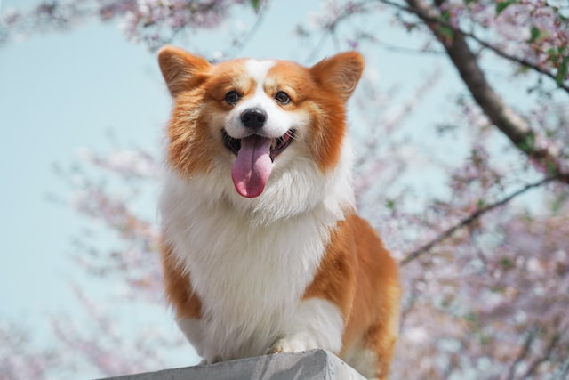
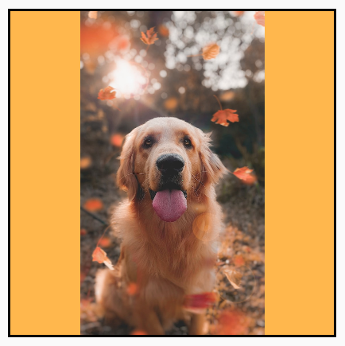
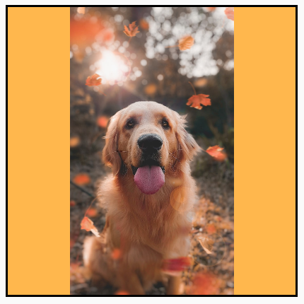
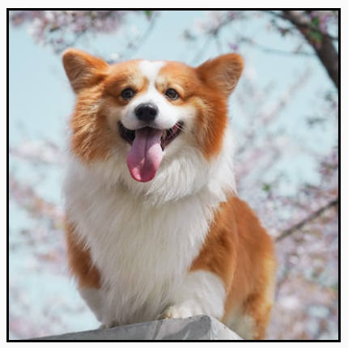
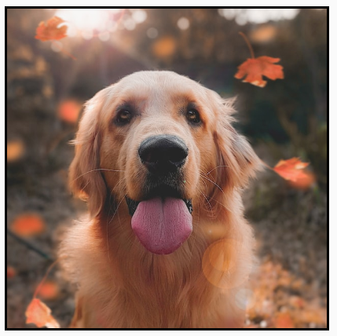
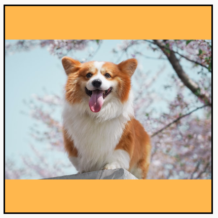
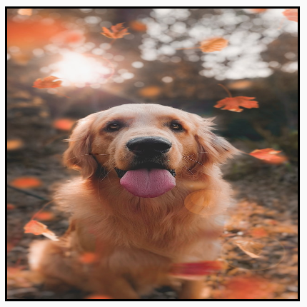
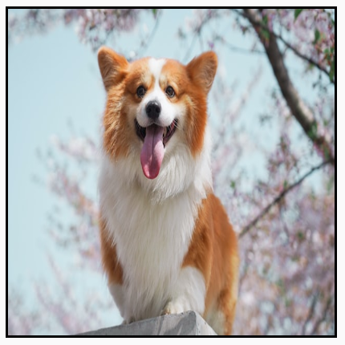
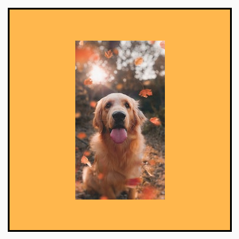
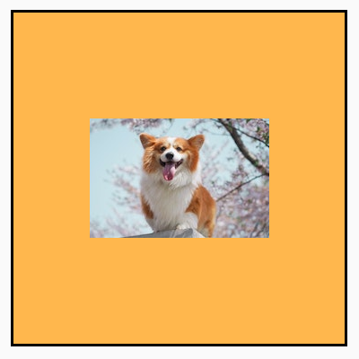

# 7.2 Composable funkcia `Image`

Pre kreslenie obrázkov používame funkciu `Image`. Tá na rozdiel od `Icon` nepodporuje atribút `tint` (pri obrázkoch nemá
veľmi význam).

```kotlin
Image(
    painter = painterResource(R.drawable.image),    // pouzitie obrazka
    contentDescription = "My Image",                // popis obrazka
    modifier = Modifier,                            // modifikator
    alignment = Alignment.Center,                   // zarovnanie obrazka vramci bounding boxu
    contentScale = ContentScale.Fit,                // ako sa ma obrazok orezat a skalovat
    alpha = 0.5f,                                   // priehladnost obrazka
    colorFilter = null                              // uprava farebnosti obrazka
)
```

Obrázku v drvivej väčšine prípadov nastavujeme modifikátor pre veľkosť. Väčšina ostatných atribútov je samovysvetľujúca,
`contentScale` si ale zasluhuje pozornosť navyše.

## Content Scale

Pre demonštráciu si predstavme, že na obrazovku chceme vykresliť dva štvorcové `Image` veľkosti `200dp`. Zdrojové
obrázky ale štvorcové nebudú:

```kotlin
Image(
    painter = painterResource(R.drawable.image),
    contentDescription = null,
    modifier = Modifier.size(200.dp),
    // contentScale = ContentScale.??? 
)
```

Jeden obrázok bude v portrait a druhý landscape orientácii. V závislosti od zvolenej `ContentScale` hodnoty sa tieto
obrázky budú škálovať nasledovne:

| `ContentScale`                                         | Popis                                                                                                                                         | Portrait                                                | Landscape                                                 |
|--------------------------------------------------------|-----------------------------------------------------------------------------------------------------------------------------------------------|---------------------------------------------------------|-----------------------------------------------------------|
| Originálny obrázok                                     |                                                                                                                                               |              |              |
| `ContentScale.Fit`                                     | zachová aspect ratio a roztiahne, alebo zmenší obrázok tak, aby bol čím väčší, ale neorezaný                                                  |                    |                    |
| `ContentScale.Crop`                                    | zachová aspect ratio, obrázok vycentruje a roztiahne, alebo zmenší tak, aby zakryl celý bounding box `Image` = môže orezať okraje             |                  |                  |
| `ContentScale.FillHeight`                              | zachová aspect ratio, obrázok roztiahne, alebo zmenší tak, aby bol rovnako vysoký ako bounding box `Image` = môže obrázok orezať horizontálne |      |      |
| `ContentScale.FillWidth`                               | zachová aspect ratio, obrázok roztiahne, alebo zmenší tak, aby bol rovnako široký ako bounding box `Image` = môže obrázok orezať vertikálne   |        |        |
| `ContentScale.FillBounds`                              | obrázok roztiahne, alebo zmenší tak, aby presne pokryl bounding box aj za cenu narušenia aspect ratio                                         |      |      |
| `ContentScale.Inside` + obrázok väčší ako bounding box | rovnaké správanie ako `ContentScale.Fit`                                                                                                      |              |              |
| `ContentScale.Inside` + obrázok menší ako bounding box | obrázok sa neškáluje                                                                                                                          |  |  |
| `ContentScale.None` + obrázok väčší ako bounding box   | rovnaké správanie ako `ContentScale.Crop`                                                                                                     |                  |                  |
| `ContentScale.None` + obrázok menší ako bounding box   | obrázok sa neškáluje                                                                                                                          |      |      |