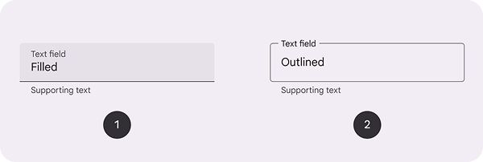

# 8.1 TextField

No a teraz šup na textové polia. Jedna sa o pomerne komplexný widget, ktorý má extrémne veľa možností štýlovania. V
Material Design existujú 2 varianty, ktoré ponúkajú out-of-the-box riešenie pre vizuál textového poľa:



1. `TextField` - textové pole s podčiarknutím
2. `OutlinedTextField` - textové pole s rámčekom

V reálnom projekte som ich asi nikdy nepoužil, vždy som si nakreslil vlastný, ktorý bol postavený na `BasicTextField`.
Ten je ale by default bez akéhokoľvek štýlovania a vyzerá ako klasický `Text`. Napísanie vlastného `TextField`u môže byť
kľudne na 200 riadkov kódu.

## Zobrazenie TextField-u

Minimálna konfigurácia `TextField`u je:

```kotlin
var value by remember { mutableStateOf("") }

TextField(
    value = value,
    onValueChange = { value = it },
)
```

Tento `TextField` zobrazuje v textovom poli hodnotu premenej `value`. Akonáhle sa zmení obsah textového poľa, zavolá sa
funkcia `onValueChange` a nová hodnota textového poľa sa uloží do premenej `value`. Všetky atribúty sú použité v tejto
ukážke:

```kotlin
TextField(
    value = value,
    onValueChange = { value = it },
    modifier = Modifier,
    enabled = true,                    // interakcia povolena
    readOnly = false,                  // read-only mod
    textStyle = bodyMedium,            // styl hlavneho textu textfieldu
    label = { Text("Telefon") },       // popis pre textfield nad textfieldom
    placeholder = { Text("Telefon") }, // placeholder text ak je textfield prazdny
    leadingIcon = { Icon() },          // ikona pred textom v textfielde
    trailingIcon = { Icon() },         // ikona za textom v textfielde
    prefix = { Text("+421 ") },        // prefix textu v textfielde
    suffix = { Text(" SK") },          // suffix textu v textfielde
    supportingText = { Text("") } ,    // text pod textfieldom
    isError = false,                   // chybovy stav textfieldu
    visualTransformation = /**/,       // nahradzanie znakov v textfielde
    keyboardOptions = /**/,            // vzhlad klavesnice
    keyboardActions = /**/,            // akcie po stlaceni "enter" na klavesnici
    singleLine = false,                // zobrazi textfield ako viacriadkovy
    maxLines = 3,                      // maximalny pocet riadkov v textfielde
    minLines = 1,                      // minimalny pocet riadkov v textfielde
    shape = TextFieldDefaults.shape,   // tvar textfieldu
    colors = TextFieldDefaults.colors(), // farby textfieldu
)
```

`label` aj `supportingText` vidíš už vo vyššie priloženom obrázku. `placeholder` je vidieť, keď v `TextField` nie je
zadaná žiadna hodnota. Môžeš pridávať ikony a texty pred a za textom a podobne. Zaujímavé sú ale tieto atribúty pre
úpravu správania klávesnice (mierne odlišné pre Kotlin Multiplatform):

1. `visualTransformation` - obvykle nechávame default alebo používame `PasswordVisualTransformation` pre heslá. Namiesto jednotlivých znakov z `value` sa zobrazí bulletpoint.
2. `keyboardOptions` - tu môžeme nastaviť viaceré atribúty:
   - `capitalization` - ako sa má v klávesnici správať kapitalizácia (napríklad prvé písmeno každého slova veľkým písmenom)
   - `autoCorrectEnabled` - povolenie autocorrectu
   - `keyboardType` - či sa jedná o klávesnicu pre zadávanie emailu, desatinného čísla, telefónneho čísla a podobne
   - `imeAction` - ako vyzerá tlačidlo <kbd>Enter</kbd> na klávesnici, napr. `ImeAction.Next`, `ImeAction.Done`, `ImeAction.Search`, `ImeAction.Send`
3. `keyboardActions` - akcie po stlačení <kbd>Enter</kbd> (`imeAction`) tlačidla na klávesnici

Ak by som chcel zobraziť napríklad textové pole pre numerické heslo, ktoré po potvrdení odošle správu použil by som takýto zápis:

```kotlin
TextField(
    value = value,
    onValueChange = { value = it },
    keyboardOptions = KeyboardOptions(
       keyboardType = KeyboardType.NumberPassword,
       imeAction = ImeAction.Send
    ),
   keyboardActions = KeyboardActions(onSend = { /* do something */ })
)
```

## BasicTextField

`BasicTextField` je primitívny komponent, okolo ktorého môžeme postaviť vlastné štýlovania a funkcie, aby lepšie
pasovali do nášho dizajnu. Keďže sa jedná o komplexný prípad použitia, skúsim ho len stručne popísať:

Najdôležitejší parameter je `decorationBox`, ktorý slúži na štýlovanie okolo vnútorného textového poľa (`innerTextField`).
Celý `decorationBox` je klikateľný a zobrazuje klávesnicu. Ak chceš nakresliť vlastný `TextField`, toto je hlavná cesta.
Ostatným parametrom sa venovať nebudeme.

```kotlin
BasicTextField(
    value = value,
    onValueChange = { value = it },
    decorationBox = { innerTextField ->
        Box(modifier = Modifier
            .fillMaxWidth()                 // textove pole zaujme celu sirku
            .border(1.dp, Color.Black)      // prida ramcek
            .padding(16.dp)                 // a padding 
        ) {
            innerTextField()                // vnutri ramceka s paddingom napise hodnotu textoveho pola
        }
    }
)
```
