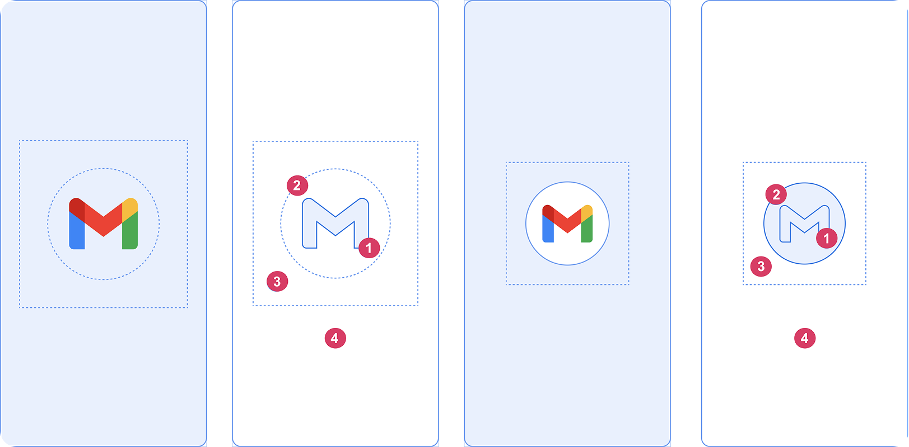
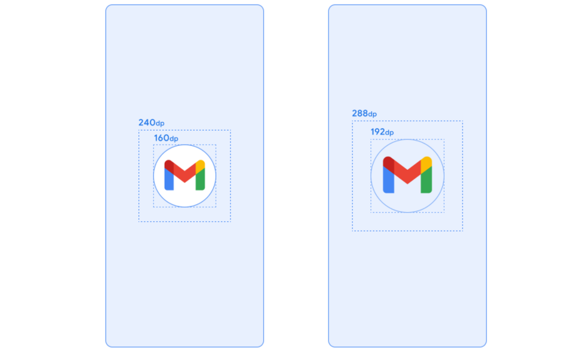

# 9.1 SplashScreen

SplashScreen je prvá obrazovka, ktorú uvidíš po kliknutí na ikonu svojej aplikácie. Väčšinou na nej vidíš logo alebo
názov aplikácie. Niekedy aj s malou animáciou. Úloha SplashScreenu je zaujať používateľa, kým sa aplikácia načíta, čo
môže byť dlhší proces.

<video controls style="width: 100%; max-width: 200px;">
  <source src="https://developer.android.com/static/images/guide/topics/ui/splash-screen/splash-screen-gmail-example.mp4" type="video/mp4">
</video>

Táto téma nám dovolí nahliadnuť do iných ako Kotlin súborov. Prvýkrát otvoríme `AndroidManifest.xml` a témy. Takže hurá
na XML.

Oficiálny návod najdete na [oficiálnej stránke](https://developer.android.com/develop/ui/views/launch/splash-screen).
Tu ho len zjednodušene prepíšem:

## Elementy SplashScreenu



1. ikona aplikácie ako vektorový obrázok, môže byť aj animovaná - animovaným vektorovým obrázkom sa venovať nebudeme
2. voliteľné pozadie ikony, môže pridať potrebný kontrast pod ikonou
3. padding ikony podľa [špecifikácie adaptívnych ikon](https://developer.android.com/develop/ui/compose/system/icon_design_adaptive)
4. jednofarebné pozadie
5. v obrázku chýba piaty bod - naspodku obrazovky vieme ešte zobraziť tzv. branding icon - často logo firmy/vývojára

## Rozmery SplashScreenu

1. Branding image má veľkosť 200×80 dp
2. Ikona aplikácie (ak používaš aj pozadie ikony) musí mať veľkosť 240×240 dp a bude orezaná do kruhu s priemerom 160 dp
3. Ikona aplikácie (bez pozadia ikony) musí mať veľkosť 288×288 dp a bude orezaná do kruhu s priemerom 192 dp



## Aplikovanie SplashScreenu

1. V súbore `app/build.gradle.kts` pridáme závislosť na splashscreen knižnici:

```kotlin
dependencies {
    implementation("androidx.core:core-splashscreen:1.0.0")
}
```

2. V súbore `themes.xml` potrebujeme aplikovať nastavenia SplashScreenu:

```xml
<?xml version="1.0" encoding="utf-8"?>
<resources>
    <style name="Theme.MyApplication" parent="android:Theme.Material.Light.NoActionBar">
        <item name="android:windowSplashScreenBackground">#FF7232</item>
        <item name="android:windowSplashScreenAnimatedIcon">@drawable/splash_icon</item>
        <item name="android:windowSplashScreenAnimationDuration">1000</item>
        <item name="android:windowSplashScreenIconBackgroundColor">#FF7232</item>
        <item name="android:windowSplashScreenBrandingImage">@drawable/branding</item>
        <item name="android:windowSplashScreenBehavior">icon_preferred</item>
    </style>
</resources>
```

Zrejme vám vyskočia aj nejaké chyby. Tie je možné ignorovať, alebo vyriešiť pomocou <kbd>Alt</kbd> + <kbd>Enter</kbd>.