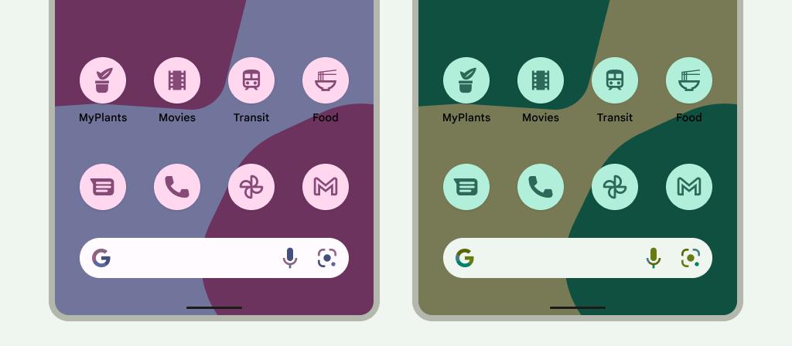

# 9.2 Launcher Icon

Dokážeme ovplyvniť aj ikonu našej aplikácie, ktorá sa zobrazuje na ploche telefónu napríklad po jeho zapnutí.
Tejto ikone nadávame Launcher Icon a jej korektné nastavenie nie je úplne priamočiare, Jedná sa totiž o adaptívnu ikonu.

Adaptívne ikony umožňujú ikone mať viacero tvarov, farieb a nejaké tie zaujímavé efekty. Ak je totiž samotná ikona
oddelená od pozadia, môžeme oboma manipulovať nezávisle na sebe.

| Adaptívne správanie                                       | Efekty                                                |
|-----------------------------------------------------------|-------------------------------------------------------|
|  |  |

Zároveň môže používateľ (ale aj programátor exernej aplikácie) tieto ikony štýlovať podľa svojich preferencií:

## Vytvorenie Launcher Icon-y

Samozrejme si môžeme tieto ikony vytvárať komplet sami. Môžeš si
1. prečítať [špecifikáciu adaptívnych ikon](https://developer.android.com/develop/ui/compose/system/icon_design_adaptive)
2. podľa špecifikácie vytvoriť hlavnú vrstvu ikony veľkosti 108x108 dp s ikonou veľkosti 48x48 dp - 66x66 dp v strede
3. spodnú vrstvu ikony - jednofarebnú alebo gradient (108x108 dp)
4. vytvoriť správnu adresárovú štruktúru (pozri si mipmap zložky)
5. ...

Alebo jednoduchšie, môžeš použiť nástroj [Icon Kitchen](https://icon.kitchen/).
1. Navrhni si ikonu podľa svojho gusta s hranatým pozadím a exportuj s názvom `ic_launcher`
2. Navrhni si ikonu podľa svojho gusta s okrúhlym pozadím a exportuj ju s názvom `ic_launcher_round`
3. Obsah priečinkov `android/res/mipmap-...` z exportovaných priečinkov skopíruj do `app/src/main/res/mipmap-...` v projekte

A Voila! Launcher Icon je hotová.

## Dodatky

**Dodatok 1:** Aká Launcher ikona sa použije pre aplikáciu vie zistiť v súbore `AndroidManifest.xml` v elemente `application` pod
atribútmi `android:icon` a `android:roundIcon`.

**Dodatok 2:** Odporúčal som vytvárať projekt s `minSdk` od verzie `28` (pozri `app/build.gradle.kts`). Preto sa dá výstup z IconKitchen skrátiť
1. priečinok `mipmap-anydpi-v26` môžeme premenovať na `mipmap`
2. odstrániť v každom priečinku `mipmap` všetky obrázky s názvom `ic_launcher.png` (keďže `ic_launcher` už máme definovaný v `mipmap`)
3. odstrániť v každom priečinku `mipmap` všetky obrázky s názvom `ic_launcher_round.png` (keďže `ic_launcher_round` už máme definovaný v `mipmap`)

**Dodatok3:** Toto je nastavenie výlučne pre Android. V prípade KMP projektu musíš iOS Launcher Icon definovať ich [šandardnou cestou](https://developer.apple.com/design/human-interface-guidelines/app-icons).