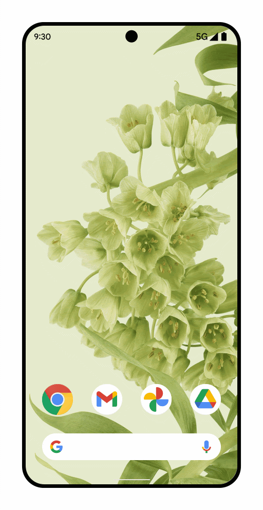

# 10.1 Navigácia medzi obrazovkami

Ďalším klasickým problémom pri programovaní Android aplikácii je riešenie navigácie medzi obrazovkami. Navigáciu vieme
riešiť úplne jednoducho pomocou `enum` tried, `if` statementov a `mutableState` nasledovne:

```kotlin
enum class Screen { Dashboard, Login, UserDetail }

class MainActivity : ComponentActivity() {
    override fun onCreate(savedInstanceState: Bundle?) {
        super.onCreate(savedInstanceState)
        setContent {
            var screen by remember { mutableStateOf(Screen.Dashboard) }
            when (screen) {
                Screen.Dashboard -> DashboardScreen(onLoginClick = { screen = Screen.Login })
                Screen.Login -> LoginScreen()
                Screen.UserDetail -> UserDetailScreen()
            }
        }
    }
}
```

Akonáhle sa zmení hodnota premennej `screen`, JetPack Compose automaticky nahradí starú obrazovku novou. Sú tu ale isté
problémy. Napríklad:
1. obrazovka `UserDetailScreen` by mala prijímať parameter s používateľom. S enumom je to nemožné - môžeme opraviť `sealed` triedou
2. ak sa zmení konfigurácia telefónu (napríklad otočíš obrazovku o 90 stupňov) - funkcia `onCreate` sa znovu spustí a premenná `screen` sa znovu nastaví na `Dashboard` - môžeme opraviť pomocou `rememberSaveable`
3. ak používateľ stlačí Back button na telefóne, aplikácia sa zavrie bez ohľadu na to ako hlboko v aplikácii sa nachádzame - môžeme opraviť napríklad držaním `List<Screen>` namiesto `Screen` v premennej `screen` a funkciou `BackHandler`
4. Android 15+ poskytuje takzvaný [**"predictive back gesture"**](https://developer.android.com/guide/navigation/custom-back/predictive-back-gesture) - môžeme opraviť použitím `PredictiveBackHandler`, ale čaká nás veľká dávka vlastnej implementácie



A problémov pribúda.

## Compose navigation

Je vhodné použiť už nejaký existujúci mechanizmus. Tým je práve Compose Navigation.

Najprv pridáme závislosť na Compose Navigation do súboru `app/build.gradle.kts`:

```kotlin
// na zaciatku suboru
plugins {
    kotlin("plugin.serialization") version "2.0.21"
}

// klasicke dependencies
dependencies {
  implementation("androidx.navigation:navigation-compose:2.10.0")
}
```

A môžeme začať vymenovávať obrazovky použitím serializovateľných objektov a data tried, napríklad:
- `@Serializable object Dashboard` - reprezentuje obrazovku "Dashboard" bez parametrov
- `@Serializable data class UserDetail(val userId: Int)` - reprezentuje obrazovku "UserDetail" s parametrom `userId`
- `@Serializable data class ClassroomDetail(val classroom: Classroom)` - reprezentuje obrazovku "ClassroomDetail" s parametrom `classroom`

> **Pozor:** ak je parameter nie jednoduchého typu (`Classroom`), musíme použiť `@Serializable` aj nad triedou `Classroom`. Napríklad `@Serializable data class Classroom(val name: String)`.

Keď mám zadefinované obrazovky, môžem ich použiť v `NavHost` composable funkcii. Prikladám priamo kód:

```kotlin
// screen arguments
@Serializable data class Classroom(val classroomId: Int)

// screens
@Serializable object Dashboard
@Serializable data class UserDetail(val userId: Int)
@Serializable data class ClassroomDetail(val classroom: Classroom)

class MainActivity : ComponentActivity() {
    override fun onCreate(savedInstanceState: Bundle?) {
        super.onCreate(savedInstanceState)
        setContent {
            val navController = rememberNavController()

            // navigation
            NavHost(
                navController = navController,
                startDestination = Dashboard
            ) {
                composable(Dashboard::class) { DashboardScreen() }
                composable(UserDetail::class) { backStackEntry ->
                    val route = backStackEntry.toRoute<UserDetail>()
                    UserDetailScreen(route.userId)
                }
                composable(ClassroomDetail::class) { backStackEntry ->
                    val route = backStackEntry.toRoute<ClassroomDetail>()
                    ClassroomDetailScreen(route.classroom)
                }
            }
        }
    }
}
```

Pre vysvetlenie:

- `rememberNavController()` - nahrádza `mutableStateOf(Screen)` aj s back navigáciou
- `NavHost` - sa stará o zobrazovanie a animácie prechodov medzi obrazovkami
- `composable` - nahrádza všetky `when (screen)` prípady

Ak chceš vyvolať navigáciu, použi volanie `navController.navigate(Screen)`. Ak by si napríklad chcel prejsť z `Dashboard`
na `UserDetail`, tak by si volal `navController.navigate(UserDetail(userId = 123))`. Odporúčaný spôsob je obrazovke
Dashboard definovať lambdu `onUserClick: (userId: Int) -> Unit` a volať ju pri kliknutí na používateľa.

`DashboardScreen` môže vyzerať takto:
```kotlin
@Composable fun DashboardScreen(onUserClick: (userId: Int) -> Unit) {
    Button(onClick = { onUserClick(123) }) { Text("Janko Hrasko") }
}
```

a `composable` v `NavHost` takto:

```kotlin
composable(Dashboard::class) { DashboardScreen(onUserClick = { navController.navigate(UserDetail(userId = it)) }) }
```

Okrem navigate podporuje `NavController` aj ďalšie funkcie. Využívať budeš asi len `popBackStack`, ktorý sa v navigácii
vráti o krok späť, alebo pri `navigate` používať atribút `navOptions` ak budeš chcieť modifikovať navigačný backstack.