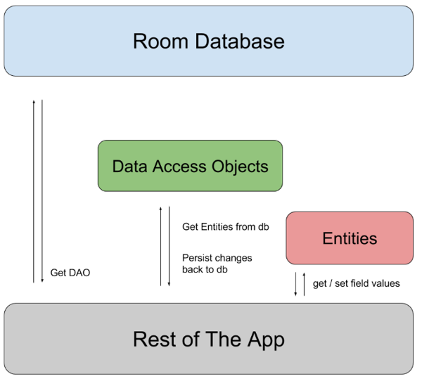

# 17.1 Room Setup

Android používa **SQLite** databázu. Jedná sa o ľahučkú single-user databázu extrémne vhodnú práve pre mobilné aplikácie.
Po niekoľkých iteráciách obslužných nástrojov sa teraz pre jej obsluhu používa knižnica **Room**. Žiadne iné alternatívy
sa v podstate nepoužívajú.

V tejto téme sa pozrieme na konfiguráciu databázy pomocou Room a následne niektoré základné CRUD operácie.

Ako referenciu používam oficiálny [návod pre prácu s Room Databázou](https://developer.android.com/training/data-storage/room).

## Room - závislosti

Potrebovať budeme `Kotlin Symbol Processing` plugin a samotné Room závislosti:

```kotlin
plugins {
    id("com.google.devtools.ksp") version "2.3.10"
}

dependencies {
    implementation("androidx.room3:room3-runtime:3.0.2")
    ksp("androidx.room3:room3-compiler:3.0.2")
}
```

## Room - architektúra



Architektúra Room databázy je založená na 3 komponentoch:
1. **Entity** - definícia tabuliek a ich mapovanie na Kotlin objekty
2. **DAO** - definícia operácií nad tabuľkou - sem budeme vkladať naše query ako napr. `INSERT`, alebo `SELECT`
3. **Database** - definícia databázy a jej relácie s DAOmi

## Room - Entity

Tabuľka v SQL databáze je definovaná niekoľkmi stĺpcami. Tieto stĺpce majú napríklad tieto vlastnosti:

1. názov stĺpca,
2. primárne kľúče,
3. cudzie kľúče,
4. hodnoty nejakého typu,
5. predvolené hodnoty

Všetky tieto veci vieme vyjadriť pomocou jednoduchej data triedy a vhodne aplikovanými anotáciami. Pozrime si príklad:

```kotlin
@Entity
data class User(
    @PrimaryKey val uid: Int,
    @ColumnInfo(name = "first_name") val firstName: String,
    @ColumnInfo(name = "last_name") val lastName: String
)
```

Tu vidíme zopár anotácií:
1. `@Entity` - označuje, že táto trieda reprezentuje tabuľku v databáze
2. `@PrimaryKey` - označuje, že `uid` je primárny kľúč
3. `@ColumnInfo` - označuje, že `firstName` / `lastName` sú klasické stĺpce tabuľky

Ak si vytvorím inštanciu tejto triedy, táto bude reprezentovať jeden riadok v tabuľke `User`. A voila, máme abstrakciu
pre tabuľku, stĺpec aj riadok databázovej tabuľky.

## Room - DAO

Samozrejme si viem predstaviť rovno písať nejaké DB query, ktoré by s entitou `User` priamo interagovali... Vo svete
Room, to ale takto nefunguje (nad dôvodmi môžeš rozmýšľať po dlhých večeroch). Namiesto toho pracujeme s konceptom
nazývaným Data Access Object (DAO). DAO je trieda, ktorá definuje operácie nad tabuľkou. Napríklad:

```kotlin
@Dao
interface UserDao {
    @Query("SELECT * FROM user")
    suspend fun getAll(): List<User>

    @Query("SELECT * FROM user")
    fun getAll(): Flow<List<User>>

    @Query("SELECT * FROM user WHERE uid IN (:userIds)")
    suspend fun loadAllByIds(userIds: IntArray): List<User>

    @Insert
    suspend fun insertAll(vararg users: User)

    @Delete
    suspend fun delete(user: User)
}
```

Zopár poznámok:
1. one-shot funkcie nesmú blokovať používateľské rozhranie, preto sú vždy `suspend`
2. ak chceme počúvať na zmeny v databáze, funkcia nebude `suspend`, ale vráti `Flow`
3. poznáme anotácie `@Query`, `@Insert`, `@Delete`, `@Update` a `@Upsert` (= Insert or Update)

Ak sa nám podarí dostať k `UserDao`, môžeme začať prácovať s databázou.

## Room - Database

Poslednou abstrakciou je samotná definícia databázy. Teda nejaké označenie, aké má databáza obsahovať tabuľky a aké DAO.

```kotlin
@Database(entities = [User::class], version = 1)
abstract class AppDatabase : RoomDatabase() {
    abstract fun userDao(): UserDao
}
```

Táto trieda reprezentuje našu databázu s jednou tabuľkou `User` a jedným DAO `UserDao`. Stále ale nie je konkrétnym
objektom. Nevieme, kde sa táto databáza reálne na disku nachádza. V praxi definujeme iba názov súboru, s ktorým má naša
databáza pracovať. Jej inštanciu tak vytvoríme nasledovným spôsobom:

```kotlin
val database =
    Room.databaseBuilder<AppDatabase>(applicationContext, "database-name")
        .setDriver(AndroidSQLiteDriver())
        .build()
```

Teda v súbore `database-name` sa bude nachádzať databáza `AppDatabase`, ktorá má jedinú tabuľku `User` a jediný DAO
`UserDao`. `UserDao` obsahuje 5 vyhradených funkcií pre prácu s databázou. Máme tak istotu, že programátor používa
iba vymedzený set funkcií a tak minimalizujeme riziko vzniku chýb.

## Room - Použitie

Premenná `database` je typu `AppDatabase`. Má teda k dispozícii funkciu `userDao()`, ktorá vráti inštanciu `UserDao`.
Takže ak spravím nasledovné:

```kotlin
val userDao = db.userDao()
```

zrazu mám k dispozícii všetky funkcie definované v `UserDao`.

```kotlin
val users: List<User> = userDao.getAll()
userDao.insertAll(User(1, "John", "Doe"))
userDao.delete(User(1, "John", "Doe"))
```

... magic ...

## Room - dodatky

Room nám poskytuje aj ďalšie funkcionality:
1. Relácie medzi tabuľkami ako [one-to-one](https://developer.android.com/training/data-storage/room/relationships/one-to-one), [one-to-many](https://developer.android.com/training/data-storage/room/relationships/one-to-many), [many-to-many](https://developer.android.com/training/data-storage/room/relationships/many-to-many)
2. Vytváranie [Views](https://developer.android.com/training/data-storage/room/creating-views)
3. [Prepopuláciu databázy](https://developer.android.com/training/data-storage/room/prepopulate)
4. [Databázové migrácie](https://developer.android.com/training/data-storage/room/migrating-db-versions)
5. a ďalšie 