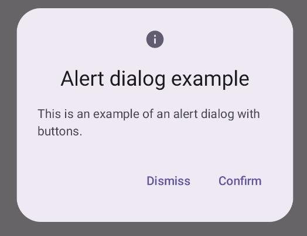
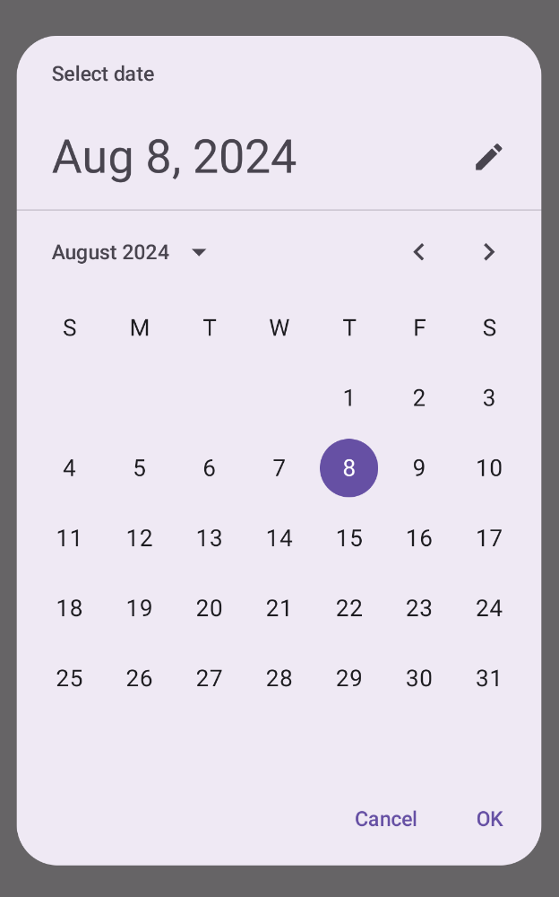
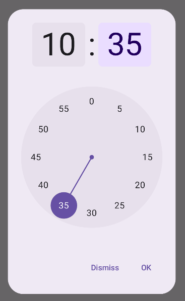

# 18.2 Dialógy

Posledným komponentom používateľského rozhrania, ktorým si chcem s vami prejsť je dialóg. Dialógy sú vyskakovacie okná,
ktoré vyžadujú používateľskú interakciu.

V JetPack Compose každý dialóg vytvorí šedý overlay cez celú obrazovku a umožní modifikovať vnútro dialógu. Dialógov
existuje viac, ukážeme si niektoré základné. Zobrazenie alebo nezobrazenie dialógu riešime štandardne pomocou
`if (showDialogState) { Dialog() }`

## Dialog

Štandardný dialóg. Vyšedí obrazovku a jeho obsah musíš kompletne definovať sám:

```kotlin
Dialog(
    onDismissRequest = {},
    properties = DialogProperties(
        usePlatformDefaultWidth = false,
        dismissOnBackPress = false,
        dismissOnClickOutside = false,
    ),
) {
    // vizual dialogu
}
```

1. `onDismissRequest` je funkcia, ktorá sa vykoná, keď používateľ vyžiada zatvorenie dialógu (klikom mimo dialóg).
2. `usePlatformDefaultWidth` nastaví šírku dialógu podľa štandardu platformy.
3. `dismissOnBackPress` nastaví, či je možné zrušiť dialóg stlačením tlačidla Back
4. `dismissOnClickOutside` nastaví, či sa dialóg zatvorí pri kliknutí mimo dialóg

## AlertDialog

`AlertDialog` je jednoducho predštýlovaný `Dialog`:



```kotlin
AlertDialog(
    onDismissRequest = {},
    properties = DialogProperties(),
    title = { Text("Title") },
    text = { Text("Text") },
    confirmButton = {
        Button(onClick = {}) {
            Text("Confirm")
        }
    },
    dismissButton = {
        Button(onClick = {}) {
            Text("Dismiss")
        }
    },
    icon = {}
)
```

1. `onDismissRequest` a `propertie` - sú totožné s `Dialog`
2. `title` a `text` - sú nadpis a text dialógu
3. `confirmButton` a `dismissButton` - sú tlačidla pre potvrdenie a zrušenie dialógu
4. `icon` - ikona dialógu

## PickerDialog-y

A ďalšie 2 pekné dialógy sú `DatePickerDialog` a `TimePickerDialog`. Jeden slúži na výber dátumu a druhý na výber času.

| `DatePickerDialog`                                                                      | `TimePickerDialog`                                                                               |
|-----------------------------------------------------------------------------------------|--------------------------------------------------------------------------------------------------|
|                                                      |                                                               |
| [Dokumentácia](https://developer.android.com/develop/ui/compose/components/datepickers) | [Dokumentácia](https://developer.android.com/develop/ui/compose/components/time-pickers-dialogs) |

Ich naštudovanie už nechám na vás.