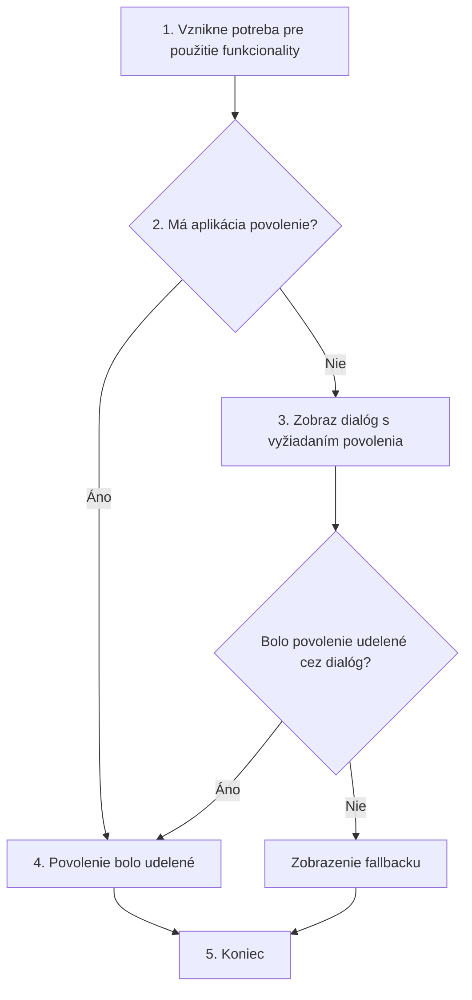

# 19.1 Čo sú runtime permissions?

Vo svete frontendových aplikácií občas potrebujeme od používateľa získať povolenie na používanie funkcionalít, ktoré
viac či menej narúšajú jeho súkromie alebo obchádzajú zabečenie systému. **Internet** je jedno z povolení, ktoré sme už
nastavovali avšak toto je tak štandarné povolenie, že si od používateľa nemusíme žiadať jeho consent.

Sú ale povolenia, ktoré si používateľov consent skutočne vyžadujú, napríklad **kamera**, **lokácia**, **mikrofón** či
prístup ku **kontaktom** alebo **galérii**. Kvôli týmto povoleniam vznikla potreba pre získanie si permissions priamo
počas behu aplikácie.

> Note: Kedysi bol zoznam všetkých permissions viditeľný v Google PlayStore a inštaláciou aplikácie si priamo súhlasil
> so všetkými povoleniami.

## Postup

Postup pre získanie runtime permissions je nasledovný:

1. Vznikne potreba pre použitie funkcionality, na ktorú treba používateľove povolenie
2. Aplikácia zistí, či už povolenie má
3. Ak aplikácia povolenie nemá
   - zobraz dialóg s vyžiadaním povolenia
   - ak povolenie cez dialóg nebolo udelené - zobrazenie fallbacku - pokračuj bodom 5
   - ak povolenie cez dialóg bolo udelené - pokračuj bodom 4
4. Povolenie bolo udelené
5. Koniec

## Štandardná implementácia

Štandardná implementácia 