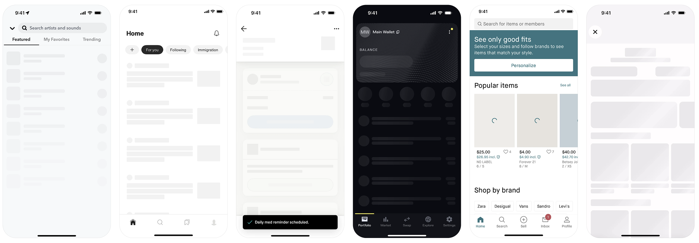
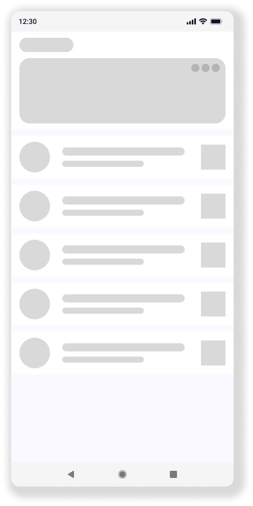

# Projekt Layouty - Skeleton Layout

Už poznáš dostatok komponentov aby si dokázal na obrazovku správne umiestňovať aspoň nejaké farebné krabičky. Síce sa
to zdá málo, ale nahradiť krabičku obrázkom, tlačidlom alebo textovým poľom je už len drobný krok. Presne to je
myšlienka tzv. skeleton layoutu. Ten používame, keď načítavame obsah obrazovky a chceme zobraziť aspoň približné
rozloženie obrazovky. Pre predstavu radšej prikladám obrázok zo stránky
[mobbin.com](https://mobbin.com/explore/mobile/ui-elements/skeleton):

Tvojou úlohou bude vytvoriť layout presne podľa presne definovaného
[dizajnu vo Figme](https://www.figma.com/design/6RDUrvTSWoa4Sw8xQNgiRG/Mobilne-Aplikacie---Kotlin---Zadanie?node-id=92-243&t=93Rzu0YcYF4iSaeE-1)

Naozaj chcem vidieť presnú kópiu toho layoutu vrátane farieb, veľkostí a odsadení, preto mysli na tieto veci:
1. Definuj si farby = pozadie, kartička, a 2 farby na kartičke. Dokopy 4 farby
2. V dizajne je 5 rovnakých kartičiek = vytvor si pomocnú `Composable` funkciu, ktorá bude definovať jednu kartičku
3. Každý komponent má nejako zaoblený roh = použi presnú hodnotu zaoblenia
4. Každý komponent má buď danú veľkosť natvrdo, alebo relatívne k obrazovke = daj si záležať, aby tvoj layout vyzeral tip-top aj na tablete aj na tvojom mobile
5. No a každý komponent má aj nejaké odsadenia od okrajov, alebo iných komponentov

Efekt, ktorý často vidíš pri načítavaní obsahu obrazovky, je tzv. shimmer efekt. Neexistuje ani modifikátor ani komponent,
ktorý vytvára tento efekt out-of-the-box. Takže sa poraď s AI alebo vyhľadaj hotové riešenie. Aplikovanie Shimmer efektu
ale nie je pre tento projekt povinné