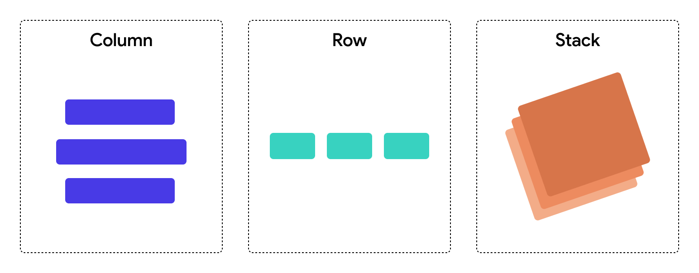

## 2.1 Layouty

Najprv sa pozrime na niektoré základné layouty. Pod layoutom si predstav taký vizuálny komponent, ktorý síce nemá žiaden
vizuál, ale pomáha nám umiestniť položky vedľa seba / pod seba / na seba / do kruhu...

V HTML sa položky ukladajú automaticky pod seba. V mnohých iných frameworkoch sa všetky elementy ukladajú na pozíciu
`[0,0]` teda do ľavého horného rohu obrazovky a prekrývajú sa.

Preto potrebujeme použiť nejaké layouty:

1. **Row** - ukladá položky vedľa seba (napr. horizontálne skrolovateľný carousel obrázkov)
2. **Column** - ukladá položky pod seba (napr. news feed)
3. **Stack** - ukladá položky na seba (napr. ikona košíka + označenie počtu položiek v košíku)

Vloženie náhodného obrázku, alebo textu do Layoutu by sme mali zvládnuť, preto sa môžeme pustiť do základných úloh.