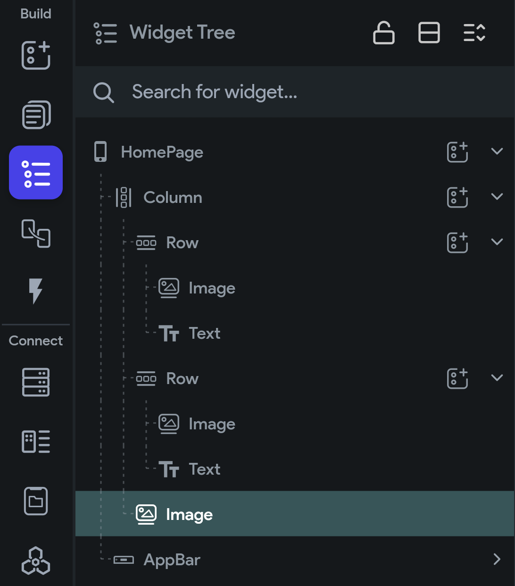

## 2.2 Widget Tree

V umiestňovaní widgetov na Canvas sa viete (hlavne v prípade layoutov) veľmi ľahko stratiť. Widgety, komponenty a
Layouty sa totiž reálne ukladajú v stromovej štruktúre. V stĺpčeku vieš mať vnorené viaceré riadky a obrázky a v každom
z riadkov ďalšie stĺpce, kontajneri a iné widgety.

```text
Stĺpec
├── Riadok
│   ├── Obrázok
│   └── Text
├── Riadok
│   ├── Obrázok
│   └── Text
└── Obrázok
```

Keď vieš, že chceš nejaký widget vložiť priamo do stĺpca a nie do riadku, ktorý sa v stĺpci nachádza, potom môže byť
vhodnejšie vložiť widget priamo do stĺpca v nejakom stromovom prehľade. Tento stromový prehľad zobrazíme pomocou
tretej záložky v Navigation Menu zvanej **Widget Tree**.

Diagram, ktorý som zakreslil vyššie by teda vo Widget Tree vyzeral nasledovne:

