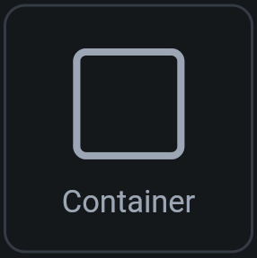
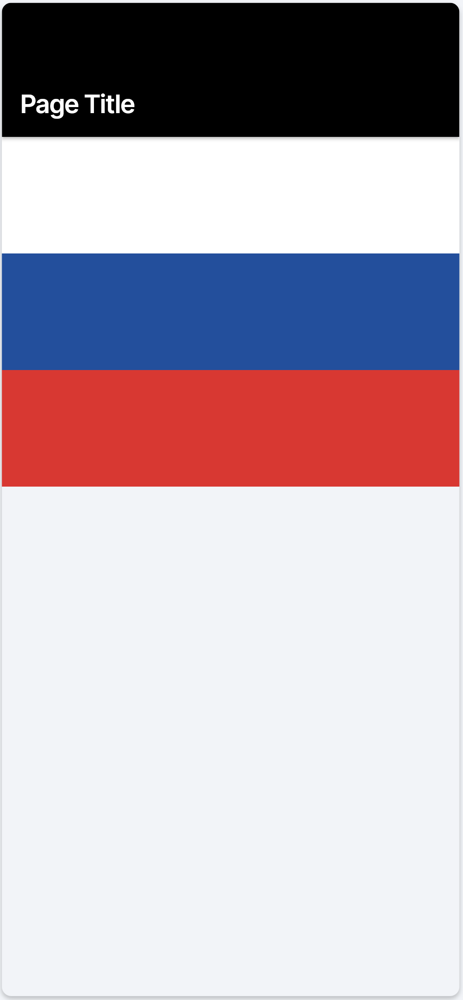
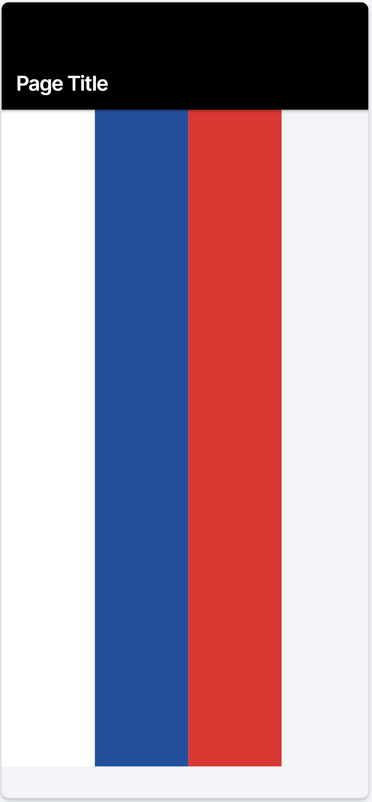
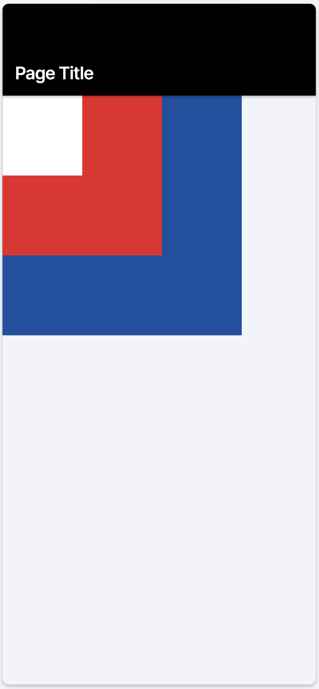
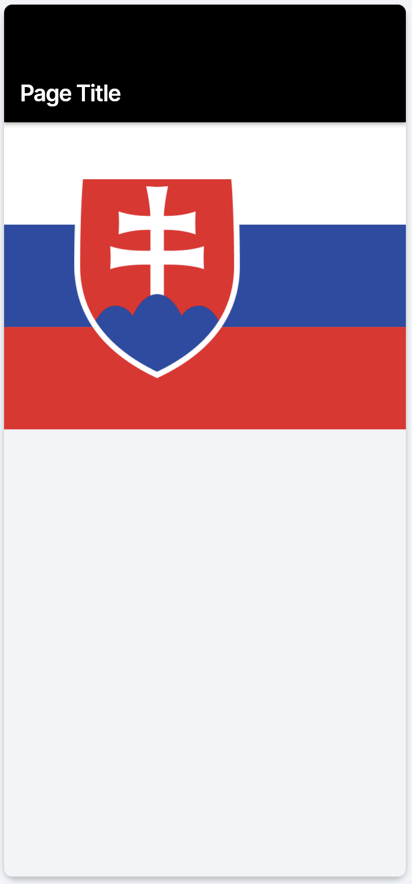

# 2.3 Layouty - zadania

Všetky tieto zadania sa týkajú nakreslenia predstavenej obrazovky. Keďže sme si ešte neukazovali zarovnania ani odsadenia,
layouty budú úplne základné. Pre zobrazenie čistej farby použite widget s názvom `Container`:

| `Container`                        |
|------------------------------------|
|  |

Farby, ktoré budeme používať sú:
1. Biela - `#ffffff`
2. Modrá - `#254aa5`
3. Červená - `#ed1c24`

## 2.3.1 Column Test

Vytvor nasledujúci layout:

- Výška jednotlivých pásov nech je `100px`.
- Pre roztiahnutie widgetu na celú šírku `Column` mu nastav šírku na ∞.
- Over vizuál na telefóne, tablete aj na desktope.

## 2.3.2 Row Test

Vytvor nasledujúci layout:

- Šírka jednotlivých pásov nech je `100px`.
- Pre roztiahnutie widgetu na celú výšku `Row` mu nastav výšku na ∞.
- Over vizuál na telefóne, tablete aj na desktope.

## 2.3.3 Stack Test

Vytvor nasledujúci layout:

- Štvorce majú veľkosti `100px`, `200px` a `300px`.
- Over vizuál na telefóne, tablete aj na desktope.

## 2.3.4 Complex (ish) Layout Test

Toto je komplexnejší layout a vyžaduje trochu skúšania. Názvy atribútov, ktoré potrebujete nastaviť musíte sami vyskúšať.

