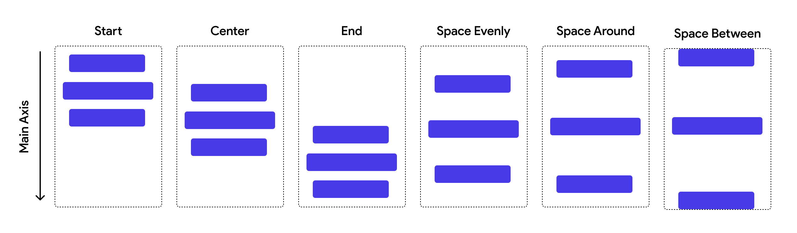
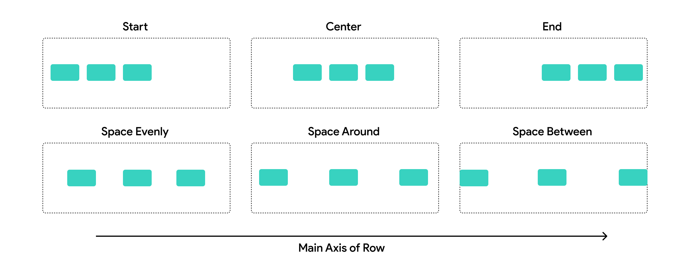

## 3.1 Main Axis Alignment

Všetky widgety vo FlutterFlow zaberajú najmenšiu možnú časť obrazovky ak to nedefinujeme inak. Ak ale náš `Column` bude
zaberať celú obrazovku. Potom môžeme FlutterFlow povedať, ako môžu byť položky `Column` alebo `Row` rozmiestnené.

Hlavná os (Main Axis) v `Column` je vertikálna. Main Axis Alignment pre `Column` bude mať teda tieto možnosti:

Hlavná os (Main Axis) v `Row` je horizontálna. Main Axis Alignment pre `Row` bude mať teda tieto možnosti:

Ak sa ti stane, že položky sa ti po nastavení Main Axis Alignment nerozmiestnia (alebo vôbec nepohnú), potom je
vysoká pravdepodobnosť, že `Column` alebo `Row` jednoducho nie sú dostatočne veľké aby sa v nich tento efekt prejavil.

### Space Evenly

Pre vysvetlenie obrázkov vyššie. **Space Evenly** vloží medzi položky medzery rovnakej veľkosti. Medzery tej istej
veľkosti ale vloží aj po oboch okrajoch. Pri troch položkách teda uvidíš 4 rovnaké medzery.

### Space Around

Veľmi zriedka používané zarovnanie. Layout sa rozdelí na toľko miest, koľko je položiek a položky v týchto miestach
umiestní do stredu. Medzi položkami tak vzniknú rovnaké medzery, ale od okrajov budú tieto položky odsadené menej.

### Space Between

Asi najčastejsie používané zarovnanie. Vložia sa rovnako veľké medzery ale len medzi položkami.