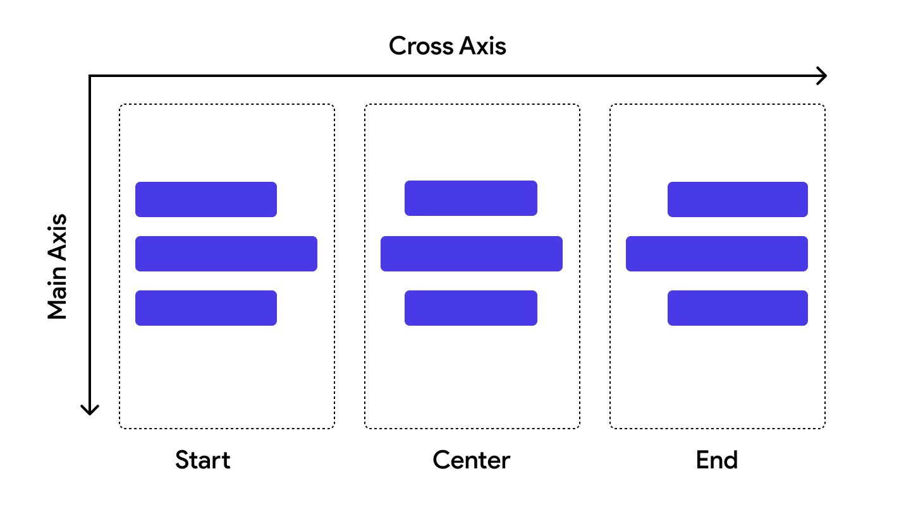
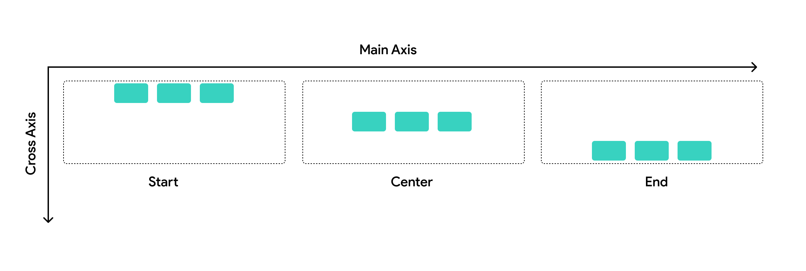

## 3.2 Cross Axis Alignment

Cross Axis Alignment zarovná deti kolmo na hlavnú os `Row` alebo `Column`. Teda ak je `Column` dostatočne široký, Cross
Axis Alignment určuje, ako sa v ňom majú položky zarovnať horizontálne. Resp. v prípade `Row`, ako sa v ňom majú položky
zarovnať vertikálne.

`Column` Cross Axis Alignment:

`Row` Cross Axis Alignment:
