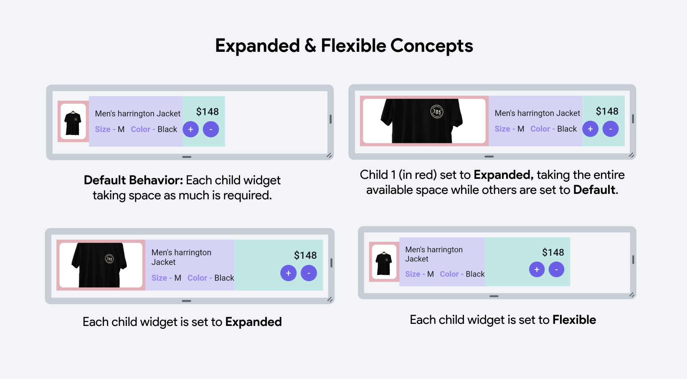

## 3.4 Flexibility

Každá položka, ktorá je priamo vložená do `Column` alebo `Row` môže mať flexibilitu. Flexibilita určuje, ako sa má
položka roztiahnuť vo svojom layoute. Klasicky je widget najmenší možný. Avšak ak mu nastavíme flag `Expanded`, zaberie
najväčšiu možnú časť layoutu tak, aby nepretekal. Ak nastavíme flag `Flexible`, zaberie stále najmenšiu možnú časť
layoutu, avšak ak by mal pretiecť cez okraj, tak sa automaticky zmení na `Expanded`.

- `Expanded` - zaberie celú dostupnú časť layoutu
- `Flexible` - zaberie najmenšiu možnú časť layoutu, avšak nepretečie

K `Expanded` a `Flexible` odporúčam pozrieť toto video: [https://youtu.be/Mmzwb0mYEQ4](https://youtu.be/Mmzwb0mYEQ4)