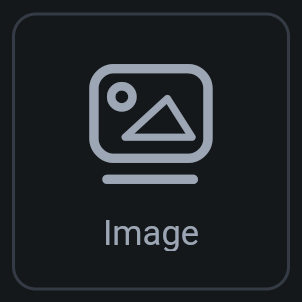
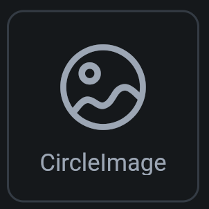
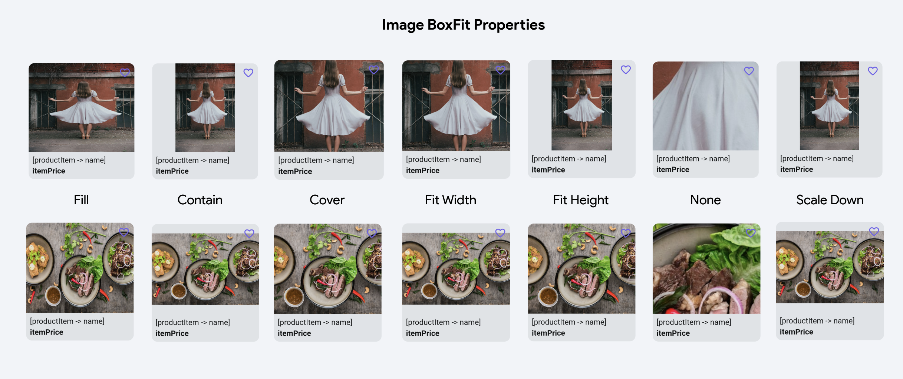

## 4.1 Obrázky

Obrázky vieme do FlutterFlow pridávať pomocou Widgetov `Image` a `CircleImage`. Jediný rozdiel medzi nimi je v tom,
že `CircleImage` zobrazí obrázok v kruhovom výreze, čo je vhodné napríklad pre avatar používateľa.

| Image               | CircleImage                      |
|---------------------|----------------------------------|
|  |  |

Tento widget dokáže zobraziť aj statické obrázky z Assets, alebo dynamicky načítané obrázky z URL.

Statické obrázky odporúčam nahrať cez Navigation Menu > Media Assets (Tab + 9)

Základné použitie je:

1. Zvoliť widget `Image` alebo `CircleImage` v zozname Widgetov a vložiť ho na stránku.
2. V Properties (pravá strana) nájsť časť Image
3. V prípade statického obrázka zvoliť Image Type ako `Asset` a vybrať správny obrázok.
4. V prípade obrázka z URL zvoliť Image Type ako `Network` a nastaviť správnu URL adresu.

### Box Fit

Miesto pre nakreslenie obrázka má fixne danú nejakú veľkosť. Ak doň vložíme obrázok, nemusí sa jeho rozmer zhodovať s
rozmerom widgetu. Ako sa má obrázok na toto miesto vložiť vieme ovplyvniť pomocou `Box Fit` v Properties.

1. **Fill** - obrázok sa zobrazí celý a vyplní aj celý priestor aj za cenu roztiahnutia/sploštenia
2. **Contain** - obrázok sa zobrazí celý a zachová svoj pomer strán - môžu tak vzniknúť prázdne okraje
3. **Cover** - obrázok zaberie celú plochu a zachová svoj pomer strán - čo trčí oreže sa
4. **Fit Width** a **Fit Height** - obrázok sa roztiahne na šírku alebo výšku a zachová svoj pomer strán - môžu vzniknúť okraje alebo orezanie
5. **None** - obrázok sa netransformuje
6. **Scale Down** - podobné Contain