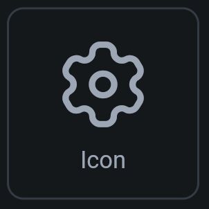

## 4.2 Ikony

Ikony sú vždy statické assety, ktoré vizuálne opisujú, čo daná časť aplikácie robí. Napríklad ozubené koliečka sú
klasicky nastavenia a ceruzka predstavuje editáciu.

| Image             | 
|-------------------|
|  |

Ikony sú obvykle štvorcové a poznáme ich rozmer (často 24x24 px) a preto Box Fit vôbec neriešime. Pri výbere konkrétneho
obrázka máme k dispozícii obrovské množstvo ikon a preto vlastné možno ani nepotrebujeme. Avšak stále sa dajú nahrať.