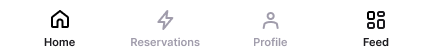
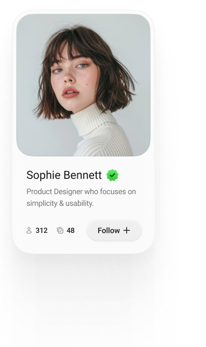

# 4.3 Zadania

## Social Login ikony

Pri aplikáciach s prihlasovaním obvykle podporujeme aj 1 alebo viac možností pre prihlásenie cez sociálne siete.
Klasické príklady sú Google, Facebook a Apple login. Niekedy sa stretneme aj s LinkedIn, GitHub alebo Twitter.

Skús nakresliť tieto tlačidlá:

Presný dizajn nájdeš na [mojej Figme](https://www.figma.com/design/6RDUrvTSWoa4Sw8xQNgiRG/Mobilne-Aplikacie---Kotlin---Zadanie?node-id=256-68&t=gEtFTQBFIUltY4dm-1).

## Bottom Navigácia

Ďalším typickým umiestnením ikon je bottom navigácia. Skús sa pripodobniť [tomuto dizajnu](https://www.figma.com/design/6RDUrvTSWoa4Sw8xQNgiRG/Mobilne-Aplikacie---Kotlin---Zadanie?node-id=261-574&t=gEtFTQBFIUltY4dm-1):

## Profilová kartička

Prikladám aj mierne zložitejšie zadanie. Skús nakresliť túto kartičku v [svetlom](https://www.figma.com/design/6RDUrvTSWoa4Sw8xQNgiRG/Mobilne-Aplikacie---Kotlin---Zadanie?node-id=256-242&t=gEtFTQBFIUltY4dm-1) aj [tmavom](https://www.figma.com/design/6RDUrvTSWoa4Sw8xQNgiRG/Mobilne-Aplikacie---Kotlin---Zadanie?node-id=256-447&t=gEtFTQBFIUltY4dm-1) prevedení:

## Kruhový avatar

V aplikáciách sa často stretávame aj s [kruhovými avatarami](https://www.figma.com/design/6RDUrvTSWoa4Sw8xQNgiRG/Mobilne-Aplikacie---Kotlin---Zadanie?node-id=265-679&t=gEtFTQBFIUltY4dm-1).
Skús nakresliť túto obrazovku:

