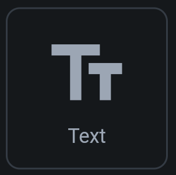

## 5.1 Text widget

Textový widget zobrazuje statický alebo dátový obsah; použite ho pre nadpisy, popisy a hodnoty z databázy.

| Image             | 
|-------------------|
|  |

Samotný `Text` má prekvapivo obrovské množstvo parametrov. Vymenujem niektoré:

1. **Font Family** - samotný font (Arial, Times New Roman, etc.)
2. **Font Weight** - hrúbka písma
3. **Font Styling** - kurzíva, podčiarknutie, ...
4. **Font Size** - veľkosť fontu
5. **Text Color** - farba textu
6. a ďalšie

### Globálne textové štýly

A keďže textové štýly sa často prepoužívajú (aby sme nemuseli všetky tieto hodnoty dookola manuálne nastavovať),
obvykle tieto štýly definujeme globálne.

V záložke Theme Settings

v sekcii Typography & Icons vieme nastaviť štýly pre:

1. Display Large/Medium/Small - pre obrovské texty (napríklad text, ktorý sa skroluje cez celú obrazovku)
2. Headline Large/Medium/Small - pre hlavičky (napríklad nadpisy)
3. Title Large/Medium/Small - pre nadpisy (napríklad nadpisy pod hlavičkami)
4. Body Large/Medium/Small - pre obyčajné texty (napríklad popisy)
5. Label Large/Medium/Small - pre označenia (napríklad popisky pre vstupné polia)

Správny dizajnér by mal vedieť dopredu definovať tieto štýly a správny programátor by ich mal vedieť podchytiť v kóde.