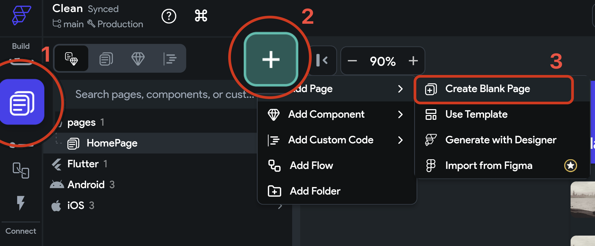

# 6.1 Pages

Zatiaľ sme sa hrali iba na jednej obrazovke. Chcem sa rýchlo dostať ku tlačidlám a vo FlutterFlow je najjednoduchšie po
kliknutí zobraziť práve novú stránku. Preto si nejakú vytvoríme:

1. V Navigation menu zvolíme záložku **Page Selector** (TAB + 2). Tu môžeme vidieť zoznam stránok (a v budúcnosti
   komponentov)
2. Po stlačení tlačidla `+` máme na výber
3. vytvorenie novej prázdnej stránky (`Create Blank Page`)

A keď ju pomenujeme, objaví sa v zozname stránok v **Page Selector** menu.

Odteraz vieme v **Page Selector** prepínať medzi jednotlivými stránkami aplikácie a tieto následne editovať.