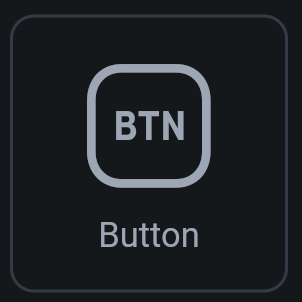
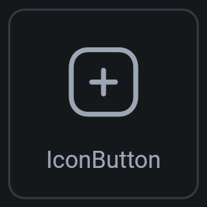
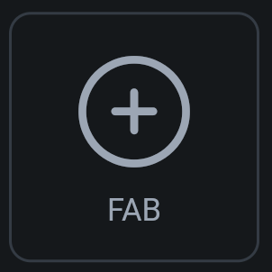
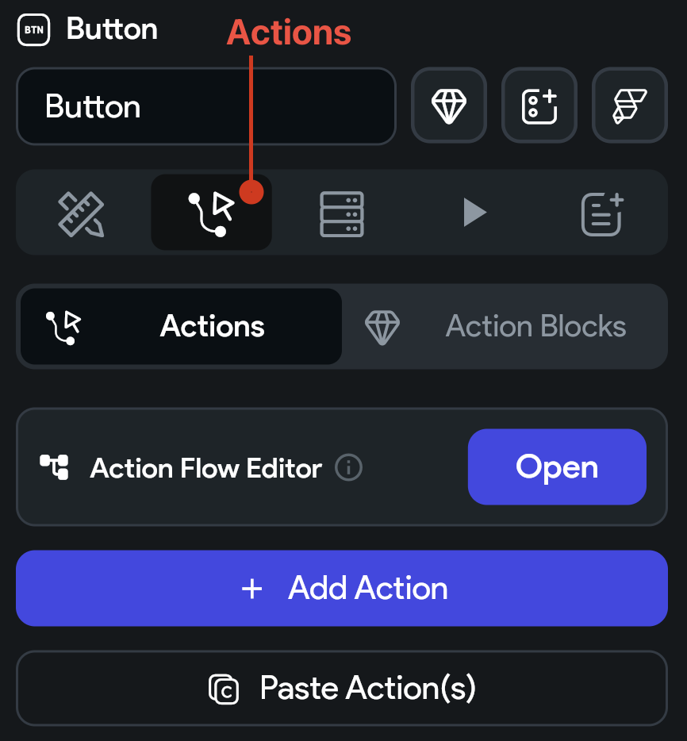
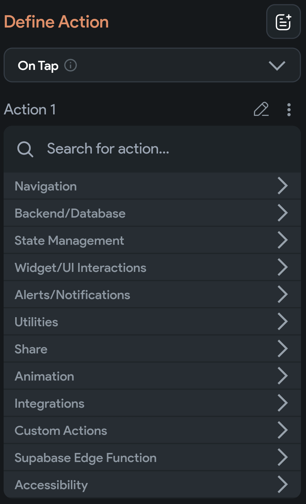

## 6.1 Button

`Button`, `IconButton` alebo `FAB` sú klasické klikateľné widgety. Obvykle obsahujú nejaký text alebo ikonu, ktorá
napovedá o funkcionalite tlačidla. Budú to prvé widgety ku ktorým napojíme nejaké správnie -> akcie.

| Button                | IconButton                     | FAB             |
|-----------------------|--------------------------------|-----------------|
|  |  |  |

Štýlovanie tlačidla obnáša predovšetkým veľkosť a farbu tlačidla + štýlovanie textu, či ikony, ktorú obsahuje. Tieto
možnosti štýlovania ľahko odhalíte aj sami, poďme sa radšej venovať akciám.

### Akcie

V Properties Paneli prvýkrát otvoríme kartu `Actions`.

Po pridaní akcie sa predvolene zvolí akcia `On Tap`, teda akcia, ktorá sa vykoná po kliknutí na tlačidlo. V tejto akcii
volíme, čo sa má udiať a možností teda máme neúrekom. Od navigácie, cez zmenu stavu aplikácie, či zápis do databázy.
Spustenie animácie, alerty, notifikácie a podobne.

Keď otvoríme napríklad záložku Navigation > Navigate To, môžeme zvoliť cieľovú obrazovku, ktorú chceme otvoriť po
kliknutí na tlačidlo.
