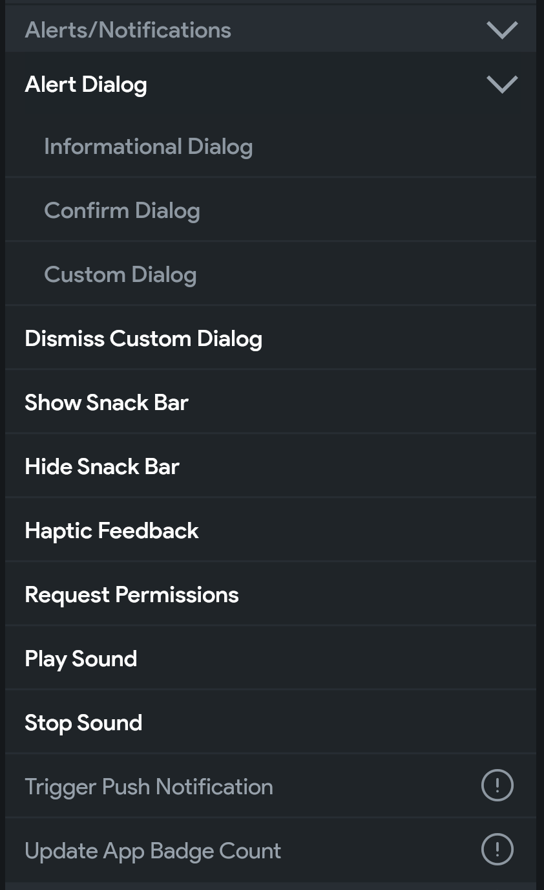
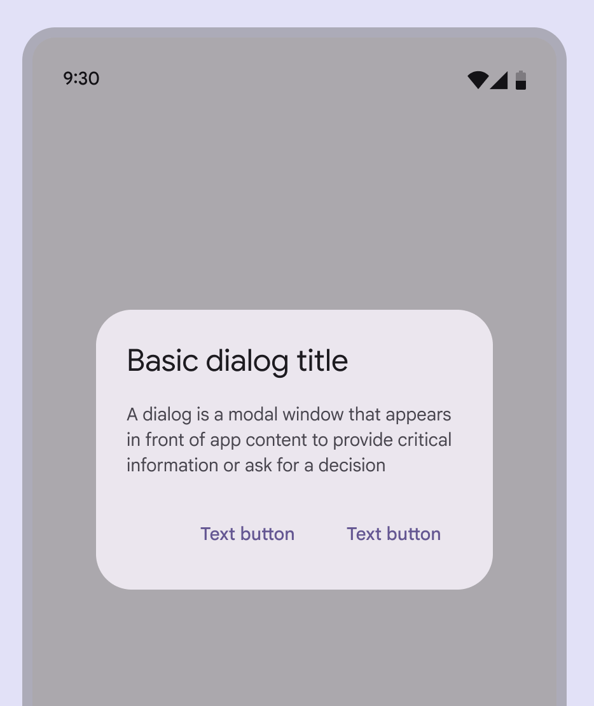
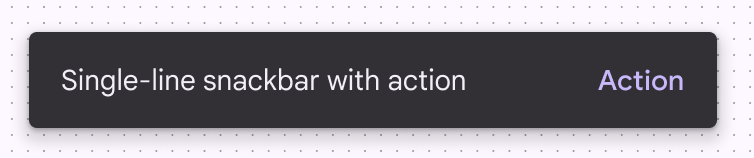

## 6.3 Alerty

Ďalšou priamočiarou možnosťou pre akciu `On Tap` je zobrazenie nejakej formy správy. Tu existuje viacero možností.
Ukážeme si niektoré z nich.

V akcii `On Tap` máme na výber záložku s názvom **Alerts/Notifications**, odtiaľ si môžeme zvoliť jednu z foriem
alertu:

### Dialógy

Prvou formou alertov sú `Alert Dialog`-y. V jednoduchosti je to vyskakovacie okno so správou a tlačidlami na akcie.
Dialógy musia byť zobrazené, kým používateľ nad nimi nevykoná nejakú akciu:

### SnackBar

Ďalšou formou alertov sú `SnackBar`-y. Tieto sa zobrazujú na spodku obrazovky a majú nastaviteľnú dobu trvania. Takže
nemusia nutne vyžadovať interakciu používateľa:

