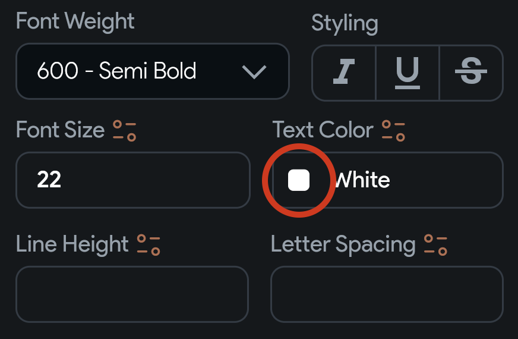
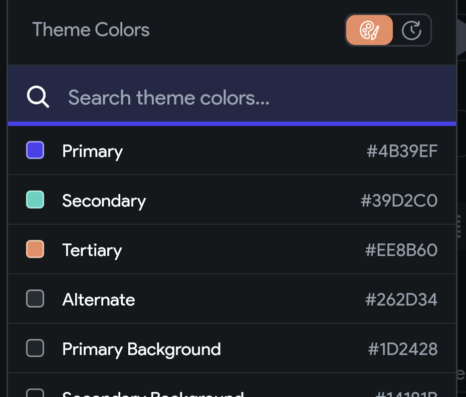

## 7.1 Theme farby

V aplikáciách sa často opakujú niektoré prvky. Jedným z opakovaných prvkov je typografia, o ktorej sme sa už raz
rozprávali. Ďalšou okapovanou zložkou sú napríklad farby. Pre tie je tiež vhodné definovať zdieľanú paletu. Často má
totiž rovnakú farbu primárne tlačidlo a text v textovom tlačidle, či horný bar.

Flutter všeobecne podlieha Material Design o ktorom si vieš niečo načítať na
[oficiálnych stránkach](https://m3.material.io/). V prípade farieb definuje Material Design niekoľko základných rolí
farieb, s ktorými sa spájajú doplnkové farby. Ak si pozrieme napríklad **Primary** rolu, tak s ňou sa spájajú tieto
farby:

1. **Primary** - primárna farba - napríklad farba hlavného tlačidla
2. **On Primary** - farba textu alebo ikon, ktorá sa vykresľujú na primárnej farbe
3. **Primary Container** - farba väčšieho primárneho prvku - obvykle podklad pod dôležitou časťou aplikácie
4. **On Primary Container** - farba textu alebo ikony na Primary Containteri
5. **Surface** a **On Surface** - farby spojené s pozadím aplikácie
6. **Error** a **On Error** - farby spojené s chybovými hláseniami
7. a ďalšie

FlutterFlow týchto farieb definuje menej, aby nám uľahčil výber.

### Definovanie zdieľaných farieb

Nejaké farby sú prednastavené hneď ako vytvoríš nový projekt, aby si ho náhodou nemal celý v bielej, alebo čiernej
farbe. Tieto farby je ale vhodné nastaviť podľa vlastných potrieb:

1. V bočnom menu otvor záložku `Theme Settings`
2. V sekcii `Colors` definuj farby podľa potreby

Určite vyskúšaj záložky:
- `Explore Project Colors` - pre priamy náhľad farieb v projekte
- `Import from Coolors` - pre import farieb z pekného nástroja na generovanie farieb - [Coolors](https://coolors.co/)

### Aplikovanie definovaných farieb

1. Zvoľ `Text` widget, ktorému chceš nastaviť farbu (platí aj pre iné widgety s farbou)
2. V **Properties Paneli** pod **Text Color** klikni priamo na color picker
3. V sekcii `Theme Colors` vyber farbu z témy

