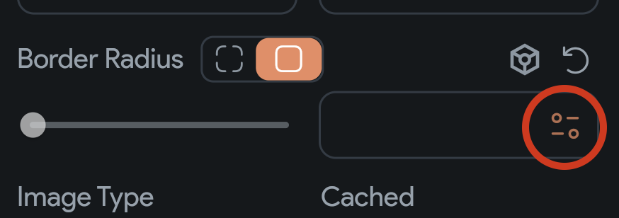
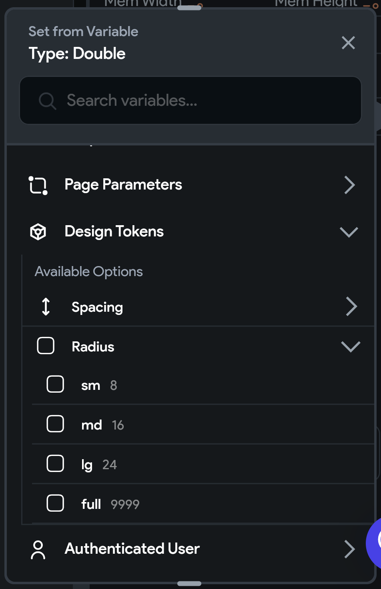

## 7.2 Theme Design Tokens

Dizajn tokeny sa obvykle týkajú špecifických rozmerov. V záložke `Design Tokens` vidíme konkrétne:

1. Spacing - ako veľmi majú byť od seba odsadené widgety - napríklad medzera medzi tlačidlami
2. Radius - veľkosť zaoblených rohov
3. Shadows - farby a odsadenie tieňov pod niektorými widgetmi

Všetky tieto nastavenia je dobré poznať dopredu a zrejme ich nebudete meniť. Prekvapiť vás ale môžu označenia ako:
`xs`, `sm`, `md`, `lg`, `xl`, `full` - v tomto prípade sa jedná výlučne o označenie rôznych veľkostí. Pre tlačidlo asi
budeš chcieť mať iný **Border Radius** ako pre klasický obrázok.

### Aplikácia

Rozmer, ktorý tu nastavíš, vieš následne aplikovať na niektoré widgety. Napríklad vieš ľubovoľnému obrázku nastaviť
`Border Radius`. Tu by sa hodilo použiť niektorý z tokenov typu `Radius` ako `md` alebo `lg`.

1. Zvoľ widget, ktorému chceš nastaviť takýto rozmer
2. V **Properties Paneli** pod **Border Radius** klikni na oranžovú ikonu = premenné
3. A v **Design Tokens** nájdi požadovaný rozmer

