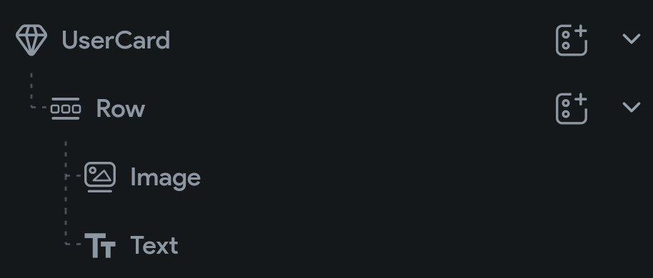
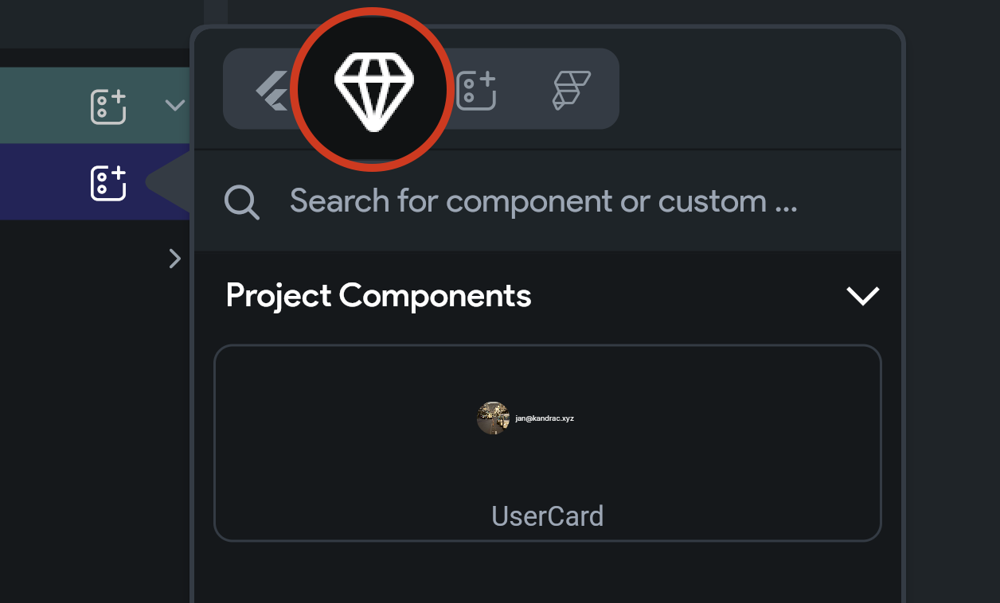

## 8.1 Vytvorenie komponentu

Veľmi často sa stáva, že okrem štýlov a farieb potrebujeme prepoužívať aj väčšie kusy používateľského rozhrania. Bolo by
skutočne nevhodné, aby sme kartu reprezentujúcu používateľa (avatar, meno, email) museli na troch rôznych stránkach
písať vždy od nuly.

Potrebujeme si teda vytvoriť takzvaný **komponent**. Vo FlutterFlow sa komponenty označujú symbolom diamantu. Príkladom
komponentu môže byť napríklad `Row` s obrázkom používateľa a jeho emailom. Ako na to?

1. Zvolíme si **Page Selector (TAB + 2)**
2. Tlačidlo `+`
3. Add Component > Create Blank Component
4. Pomenujeme ho napríklad `UserCard`

V **Canvas** sa zobrazí nový (prázdny) komponent `UserCard`, ktorý môžeme naplniť widgetami a nastaviť ich vlastnosti.
Tento **Canvas** sa podobá na **Canvas** pri editácii stránky.

Od tohto momentu môžeme komponent `UserCard` vložiť priamo na akúkoľvek stránku. Pri pridávaní komponentu postupujeme
rovnako ako pri pridávaní Widgetu avšak komponent nájdeme pod ikonou diamantu.

