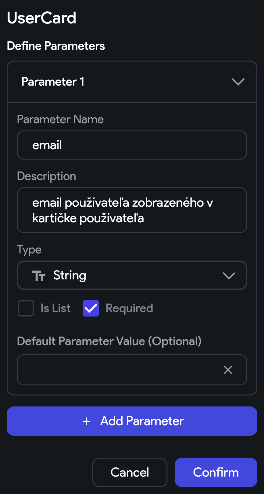
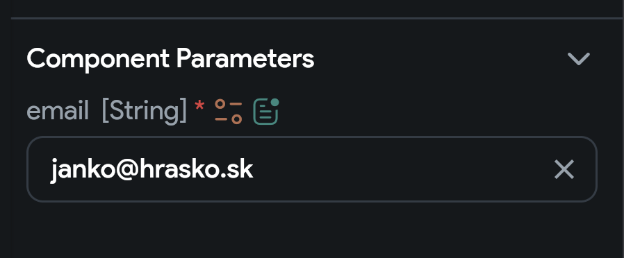

## 8.2 Parametre komponentu

Načo by nám bol komponent, ktorý vždy vyzerá rovnako a vždy sa aj rovnako správa? Karta používateľa rozhodne musí byť
schopná zobrazovať rôzne informácie o rôznych používateľoch. Preto potrebujeme komponent s parametrami.

### Vytvorenie parametra komponentu

1. Vo **Widget Tree** (alebo akýmkoľvek iným spôsobom) zvolíme náš komponent
2. V **Properties Panel** sa zobrazí sekcia **Component Parameters**
3. Cez tlačidlo `+` pridáme nový parameter s názvom napr. `email` a typom `String`

Ukážku správne nastaveného parametra pozri na obrázku nižšie:

### Použitie parametra komponentu

Zvonka by sme teda mali vedieť poslať parameter `email` komponentu `UserCard`. Ale zatiaľ sme ho nepoužili.

1. V `UserCard` komponente zvolíme `Text`, ktorému chceme nastaviť hodnotu parametra `email`
2. V **Properties Panel** pod **Text** klikneme na oranžovú ikonu s premennými
3. A medzi **Component Parameters** vyberieme parameter `email`

Odteraz sa zvonka nastavený parameter `email` zobrazí v komponente `UserCard`.

### Nastavenie parametra komponentu

Keď náš komponent pridáme na obrazovku, bude vyžadovať parameter `email`.

1. Otvoríme **Properties Panel**
2. Nájeme sekciu **Component Parameters**
3. A nastavíme v ňom hodnotu parametra `email`

