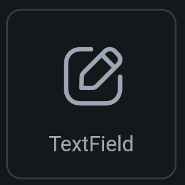
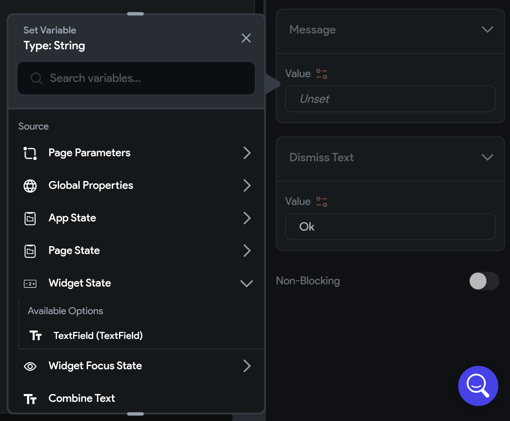

## 9.1 TextField základ

`TextField` widget prijíma a uchováva text zadaný používateľom. Použiť ho vieme napríklad pre e-mail v prihlasovacom
formulári.

| Image                        | 
|------------------------------|
|  |

TextField má obrovské množstvo možností štýlovania, odporúčam prečítať si
[dokumentáciu](https://docs.flutterflow.io/resources/forms/textfield/) 

### Získanie hodnoty TextFieldu

Jediné, čo nás pri `TextField` widgete v podstate zaujíma je to, ako vieme čítať jeho hodnotu. Skúsime to tak, že
po stlačení tlačidla zobrazíme hodnotu `TextField`-u v Dialógu.

V akcii `On Tap` máme na výber záložku s názvom **Alerts/Notifications**, odtiaľ si môžeme zvoliť zobrazenie
Informačného **Alert Dialog**-u.

Text pre tento Alert Dialog nastavíme výberom premennej zo sekcie `Widget State`.

### Úprava UI pri zmene hodnoty TextFieldu

Ďalšou možnosťou je zmena UI pri zmene hodnoty `TextField`-u. Klasicky si vieme predstaviť text pod `TextField`-om
`Text`, ktorý sa mení v závislosti od toho, či doň vložíme správne alebo nesprávne heslo.

Klasické čítanie textu z TextFieldu nebude fungovať, pretože zmena `TextField`-u neaktualizuje obrazovku. Preto
potrebujeme jednoducho povoliť `Update Page On Text Change`.

Od tohto momentu môžeme v Texte priamo použiť hodnotu `TextField`-u ako premennú zo sekcie `Widget State` (podobne
ako v prípade **Alert Dialog**-u)