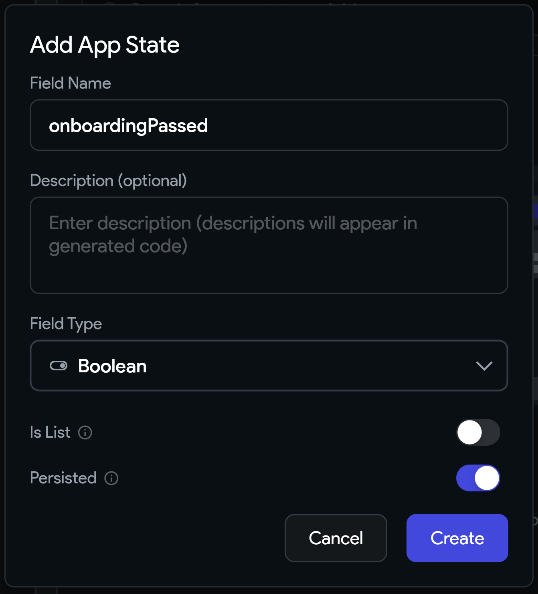
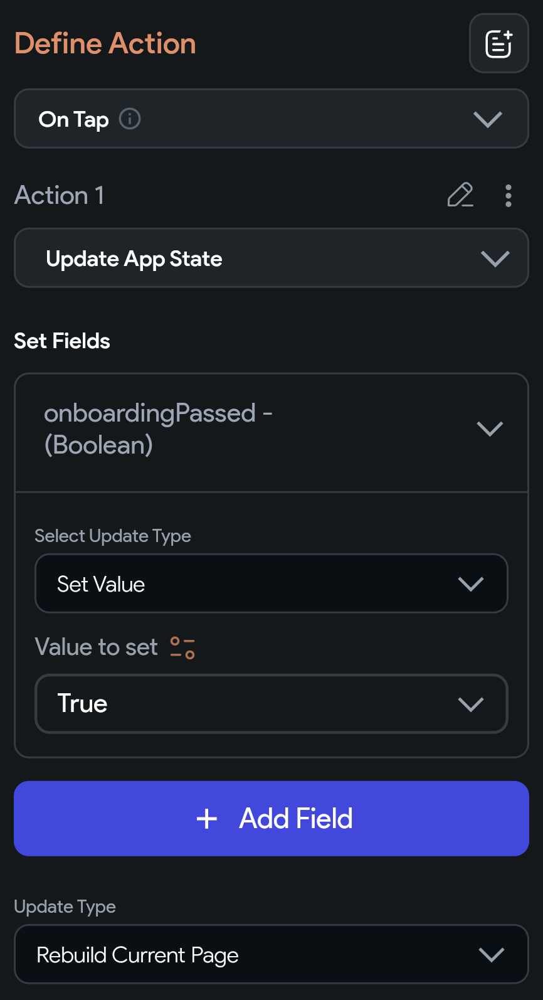

## 10.1 App State

Často si potrebujeme ukladať premenné, ktoré prežijú reštart aplikácie, alebo k nim len potrebujeme mať prístup z
viacerých stránok aplikácie.

To dokážeme spraviť pomocou premenných skrytých v **App State** (TAB + 7):

Vytvoríme si premennú napr. `onboardingPassed` typu `Boolean` s hodnotou `false`:

A kdekoľvek v aplikácii ju môžeme začať používať alebo nastavovať:
