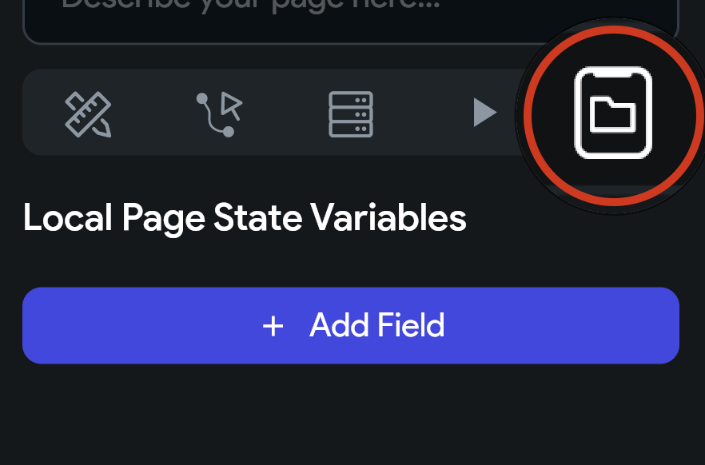

## 11.1 Page State

Tak ako vieme mať globálne premenné v globálnom **App State**, máme aj Lokálne premenné v **Page State**. Keď si zvolíme
stránku v **Page Selector** a v **Properties Panel** klikneme na **State Management**, môžeme vytvoriť novú premennú,
ktorá bude dostupná len na tejto stránke.

Použitie je totožné s použitím premenných v **App State** ale premenné sa budú nachádzať v **Page State**