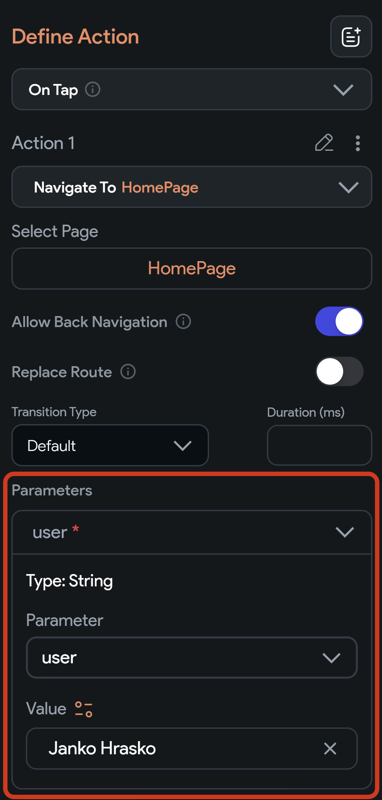
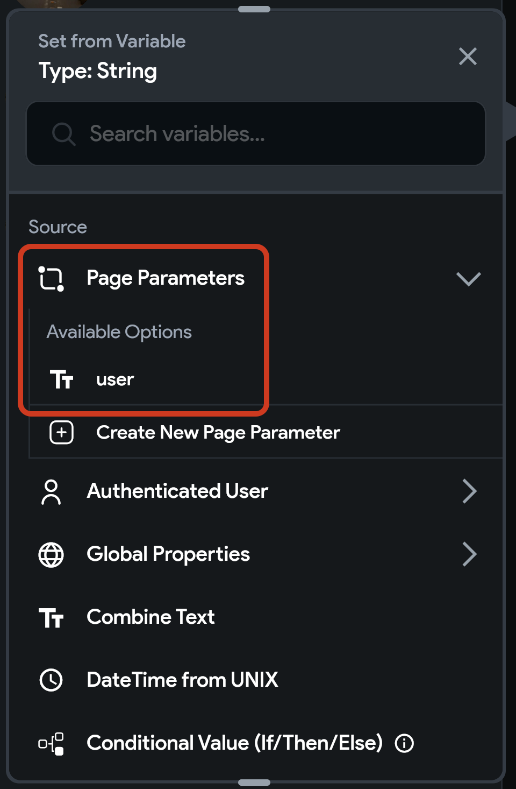

## 12.1 Page Parameter

Ak chceš na stránke zobraziť napríklad detail používateľa, musíš jej nejakým spôsobom povedať, detail ktorého
používateľa má vlastne zobraziť. To dokážeš spraviť pomocou **Page Parameters**.

### Vytvorenie parametra

1. Zvoľ stránku v `Page Selector (TAB + 2)` sekcii 
2. V **Properties Panel** stlačíme v sekcii **Page Parameters** tlačidlo `+`
3. Definujeme meno a typ nášho parametra - napríklad názov `user` a typ `String`

### Použitie parametra

Kdekoľvek na stránke môžeme použiť hodnotu parametra `user` (ak daná časť stránky vyžaduje `String`). Napríklad v `Text`
widgete môžeme nastaviť hodnotu pomocou oranžovej ikony na premennú stránky s názvom `user`.

### Nastavenie parametra

Pri navigácii na túto stránku môžeme odteraz poslať hodnotu parametra `user` ako argument.

