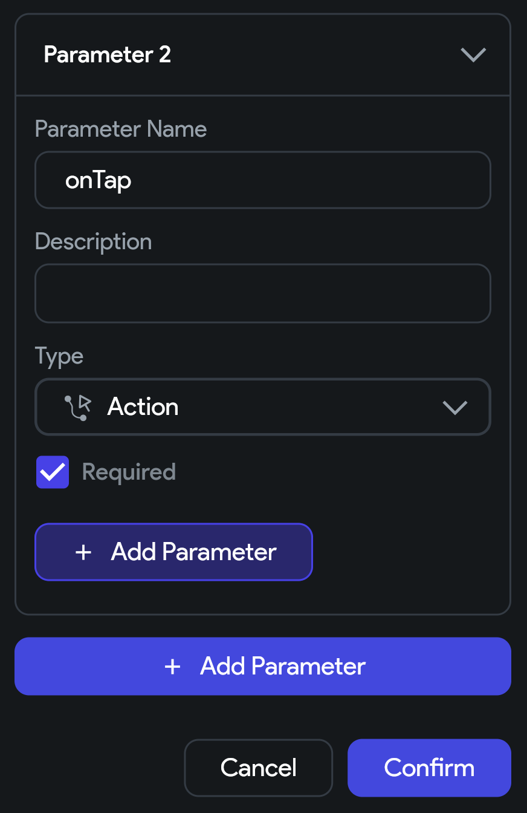
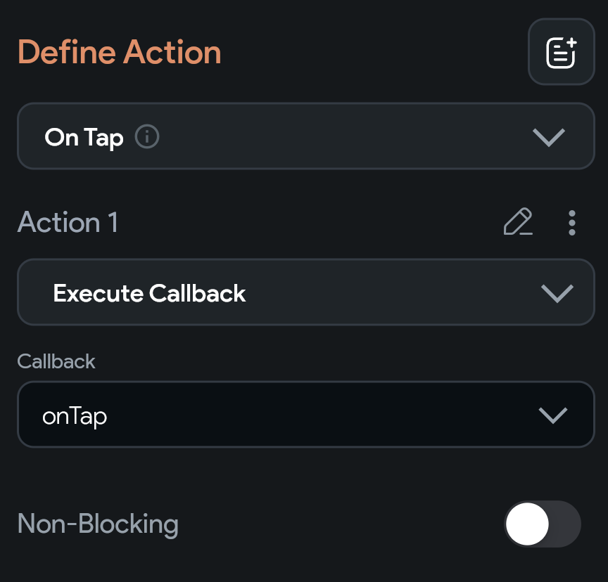

## 13.1 Akcie ako parametre komponentov

Opäť si predstav vlastný komponent s názvom `UserCard`. Ten v téme
[08 Komponenty](../08%20Komponenty/8.2%20Parametre%20komponentu.md) zobrazoval používateľov email a prípadne avatara, či
iné údaje. Mala teda nejaké vlastnosti. Otázne môže byť, čo sa má udiať po kliknutí na tento komponent.

Najjednoduchšie je dať tomuto komponentu priamo akciu `On Tap` a navigovať na obrazovku s detailom používateľa podľa
parametra `email`, ktorý sme tomuto komponentu poslali. V rôznych častiach aplikácie ale môžeme chcieť na tapnutie
komponentu vyvolať inú akciu. Napríklad:

Ak sa mi tento komponent zobrazí
1. v zozname moji priateľov - zobraz jeho detail
2. pod nejakým príspevkom - zobraz všetky príspevky od tohto používateľa
3. v zozname potenciálnych SPAM používateľov - odstráň ho zo zoznamu
4. a podobne

Preto chceme vedieť komponentom preposielať aj akcie.

### Nastavenie akcie pre komponent

Komponent môže prijať akciu ako parameter.

1. Otvoríme **Properties Panel** komponentu `UserCard`
2. V sekcii **Component Parameters** pridáme nový parameter s názvom napríklad `onTap` typu `Action`

### Použitie akcie v komponente

1. Na widgete, kde chceme použiť akciu `onTap`, zvolíme vytvorenie novej akcie
2. Akcia sa volá `Execute Callback`
3. A v záložke Callback zvolíme nami vytvorený parameter `onTap`

### Použitie akcie pre komponent

Na mieste, kde voláme náš komponent `UserCard`, už môžeme pridať callback pre akciu `onTap`. Musíme síce ísť cez
**Action Flow Editor**, ale jeho použitie je skutočne jednoduché.