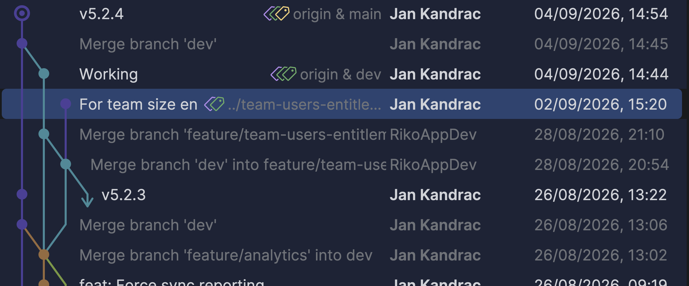

# 1.2 Konfigurácia Gitu

V Gite sa zaznamenávajú zmeny, ktoré nastali v kóde. A každá zmena musí mať nejakého autora. Autor zmeny v Gite musí mať
definované minimálne 2 hodnoty... meno a email. Uvediem textovú aj grafickú ukážku z reálneho projektu:

```bash
$ git log --graph --all -20 --format="%h - %an <%ae> %s"

27e31f5a - Jan Kandrac <jan@kandrac.xyz> For team size entitlements open RC paywall directly
4ffa2903 - Jan Kandrac <jan@kandrac.xyz> v5.2.4
05c5ca79 - Jan Kandrac <jan@kandrac.xyz> Merge branch 'dev'
9b3b0e17 - Jan Kandrac <jan@kandrac.xyz> Working
27e31f5a - Jan Kandrac <jan@kandrac.xyz> For team size entitlements open RC paywall directly
dc4c8c39 - RikoAppDev <riko.appdev@gmail.com> Merge branch 'feature/team-users-entitlements' into dev
03f26a58 - RikoAppDev <riko.appdev@gmail.com> Merge branch 'dev' into feature/team-users-entitlements
3fb74d3d - Jan Kandrac <jan@kandrac.xyz> v5.2.3
faf87963 - Jan Kandrac <jan@kandrac.xyz> Merge branch 'dev'
```



## Prečítanie mena a emailu

Meno a email používateľa zvyčajne nastavujeme len raz, a to globálne (per-user). Či je takto globálne nastavené meno a
email si môžeme overiť príkazmi:

```bash
git config --global user.name
git config --global user.email
```

Ak tieto príkazy nič nevypíšu, meno ani email nastavené nie sú.

## Nastavenie mena a emailu

Ak chceme meno a email nastaviť, použijeme príkazy:

```bash
git config --global user.name "Tvoje Meno"
git config --global user.email "tvoj@email.com"
```

Tieto údaje sa potom zobrazujú pri každom commite (napr. na GitHube uvidia ostatní, kto zmenu urobil). Meno ani email
nemusia byť naozajstné. Sú len vodítkom k autorovi. Je ale pekné sa pod svoju prácu vždy pospísať.

> **Note:** ja osobne --global pre `user.email` nikdy nepoužívam, mám totiž osobný, firemný a školský email.

## Úrovne konfigurácie

Git umožňuje nastavovať konfiguráciu na dvoch základných úrovniach (system wide úroveň nás nezaujíma). Ak aj mám nastavené
meno a email globálne, môžem ich pre konkrétny repozitár zmeniť lokálnym nastavením:

- **`--global`** – nastavenie platí pre **všetky tvoje repozitáre** pod aktuálnym používateľským účtom. Toto je najbežnejšia voľba (napr. meno a email si zvyčajne nastavuješ takto).
- **`--local`** – nastavenie platí **iba pre konkrétny repozitár**, v ktorom sa práve nachádzaš. Použi to, ak chceš mať napríklad pre pracovný projekt iný email než pre osobné projekty.

```bash
# Príklad: iný email len pre tento konkrétny repozitár
cd moj-pracovny-projekt
git config --local user.email "pracovny@email.com"
```

## Overenie nastavení

Konkrétnu hodnotu, ktorú git použije v priečinku, kde sa práve nachádzaš (`local` > `global`), zistíš takto:

```bash
git config user.name
git config user.email
```

## Zoznam nových príkazov

- `git config --global user.name` - prečítaj globálne nastavené meno používateľa
- `git config --local user.name` - prečítaj meno používateľa pre aktuálny repozitár
- `git config --global user.name "Janko Hrasko"` - nastav globálne meno používateľa na _"Janko Hrasko"_
- `git config --local user.name "Janko Hrasko"` - nastav meno používateľa pre aktuálny repozitár na _"Janko Hrasko"_

- `git config --global user.email` - prečítaj globálne nastavený email používateľa
- `git config --local user.email` - prečítaj email používateľa pre aktuálny repozitár
- `git config --global user.email "janko@hrasko.sk"` - nastav globálne email používateľa na _"janko@hrasko.sk"_
- `git config --local user.email "janko@hrasko.sk"` - nastav email používateľa pre aktuálny repozitár na _"janko@hrasko.sk"_