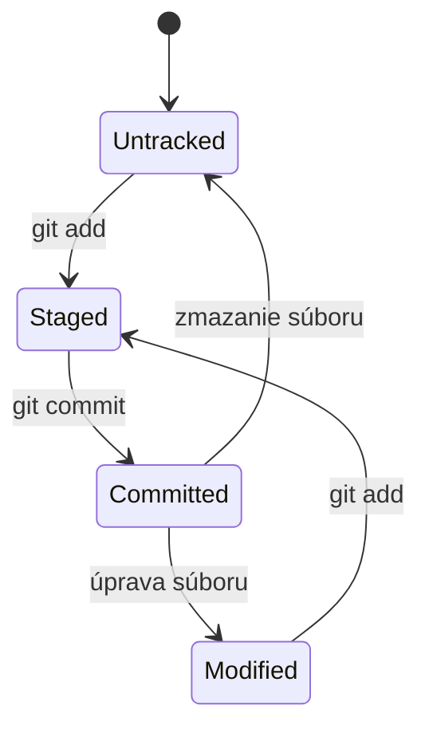

# 2.1 Zaznamenanie zmeny v Gite

K dispozícii už máme:
1. Priečinok s našimi zdrojovými súbormi
2. označený ako git repozitár
3. a Git už pozná naše meno a email

To znamená, že sme pripravený zaznamenať prvú úpravu súborov v tomto repozitári.

Všetky súbory v Git-e majú nejaký stav, alebo označenie. Existujú súbory ktoré git:

1. zatiaľ nesleduje = **untracked**
2. ktoré sú v repozitári ale neuložené = **modified**
3. ktoré sú v repozitári a sú označené na uloženie = **staged**
4. ktoré sú v repozitári a sú uložené = **committed**

Medzi týmito stavmi vieme súbory presúvať nasledovne:



## Untracked -> Staged

Akonáhle si v repozitári vytvoríš nový súbor, ten je označený ako **untracked**. Git v podstate čaká, čo má s týmto
súborom spraviť… Je to len dočasný pomocný súbor, alebo ho chceš zahrnúť do repozitára?

Ak ho chcem zahrnúť do repozitára, musím ho najprv označiť ako **staged** = presunúť do tzv. **Staging Area**. Súbor
presuniem do **staged** stavu pomocou príkazu:

```bash
git add nazov_souboru
```

> **Note:** Pridávať vieme viacero súborov naraz. Často pridávame všetky naraz pomocou `git add .`

## Staged -> Committed

Súbor už je **staged** = prichystaný na uloženie do repozitára. Aby sme súbor konečne dostali do histórie Gitu a
vytvorili novú verziu, použijeme príkaz `git commit`.

```bash
git commit -m "Prvá verzia"
```

Kde prepínač `-m` slúži na zadanie správy, ktorá sa uloží s touto verziou. K verzii sa zároveň prilepí tvoje meno a email,
ktoré si nastavil pomocou `git config`.

> **Note:** `git commit` odošle do verzie všetky súbory zo **staging area**.

## Committed -> Modified

Ak bol súbor už kedykoľvek v histórii commitnutý, tak akákoľvek úprava tohto súboru ho presunie do stavu **modified**.

Modifikovaný súbor je potrebné dostať do stavu **staged** pomocou príkazu `git add` a potom do stavu **committed** pomocou
príkazu `git commit`.