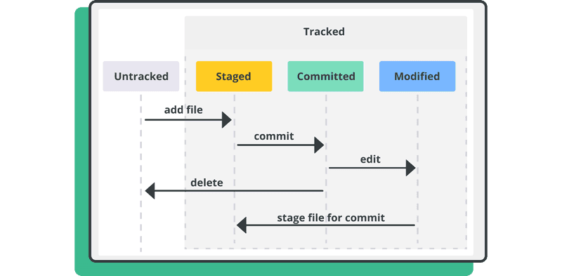

# 2.2 Test - Stavy súborov v Gite

Over si svoje vedomosti z kapitoly o stavoch súborov v Gite. Keďže sa jedná o tému náročnejšiu na teóriu, môžeš si pri týchto otázkach pomôcť týmto diagramom:

Klikni na **Áno** alebo **Nie** - tlačidlo sa hneď zafarbí (zelená = správne, červená = nesprávne) a zobrazí sa komentár s vysvetlením. Otázky prechádzaš po jednej pomocou tlačidiel nižšie.

Otázka 1 / 7

  
Súbory, ktoré git už sleduje, voláme <strong>tracked</strong>.

  

    <button type="button" class="quiz-btn quiz-yes">Áno</button>
    <button type="button" class="quiz-btn quiz-no">Nie</button>
  

  
<strong>Áno.</strong> Súbory v repozitári sú buď <strong>tracked</strong> alebo <strong>untracked</strong>.

  
<strong>Tracked</strong> súbory sú buď <strong>modified</strong> alebo <strong>committed</strong>.

  

    <button type="button" class="quiz-btn quiz-yes">Áno</button>
    <button type="button" class="quiz-btn quiz-no">Nie</button>
  

  
<strong>Nie.</strong> Existuje aj tretí - <strong>staged</strong> - stav.

  
Ak bol súbor <strong>untracked</strong>, jeho editáciou sa presunie do stavu <strong>modified</strong>.

  

    <button type="button" class="quiz-btn quiz-yes">Áno</button>
    <button type="button" class="quiz-btn quiz-no">Nie</button>
  

  
<strong>Nie.</strong> Súbor bude v stave <strong>untracked</strong> až kým nad ním nezavoláme <code>git add</code>. Modifikácia súboru jeho stav z <strong>untracked</strong> nezmení.

  
Príkaz <code>git add subor</code> presunie súbor s názvom <code>subor</code> zo stavu <strong>untracked</strong> alebo <strong>modified</strong> do stavu <strong>staged</strong>.

  

    <button type="button" class="quiz-btn quiz-yes">Áno</button>
    <button type="button" class="quiz-btn quiz-no">Nie</button>
  

  
<strong>Áno.</strong> Príkaz <code>git add</code> má zmysel len pre <strong>untracked</strong> alebo <strong>modified</strong> súbory a skutočne ich presunie do stavu <strong>staged</strong>.

  
Príkaz <code>git commit</code> uloží súbory zo stavu <strong>staged</strong> do histórie Gitu.

  

    <button type="button" class="quiz-btn quiz-yes">Áno</button>
    <button type="button" class="quiz-btn quiz-no">Nie</button>
  

  
<strong>Áno.</strong> Vznikne tak nový commit a súbor sa presunie do stavu <strong>committed</strong>.

  
Súbor môže byť v stave <strong>modified</strong> len ak bol aspoň raz commitnutý.

  

    <button type="button" class="quiz-btn quiz-yes">Áno</button>
    <button type="button" class="quiz-btn quiz-no">Nie</button>
  

  
<strong>Nie.</strong> Toto je chyták. Ak bol súbor pridaný do gitu pomocou <code>git add</code> a následne bol upravený, tento súbor je zároveň <strong>staged</strong> aj <strong>modified</strong>.

  
Všetky <strong>modified</strong> súbory dostaneme do stavu <strong>committed</strong> volaním príkazu <code>git commit</code>.

  

    <button type="button" class="quiz-btn quiz-yes">Áno</button>
    <button type="button" class="quiz-btn quiz-no">Nie</button>
  

  
<strong>Nie.</strong> Príkaz <code>git commit</code> uloží iba súbory zo stavu <strong>staged</strong>. Ak chceme uložiť aj <strong>modified</strong> súbory, musíme ich najprv presunúť do stavu <strong>staged</strong> pomocou <code>git add</code>.

  <button type="button" id="quiz-prev" class="quiz-nav-btn" disabled>&larr; Predchádzajúca</button>
  <button type="button" id="quiz-next" class="quiz-nav-btn" disabled>Ďalšia &rarr;</button>

  
Tvoje skóre je 0 / 8

  <button type="button" id="quiz-restart" class="quiz-nav-btn">Absolvovať test znova</button>

