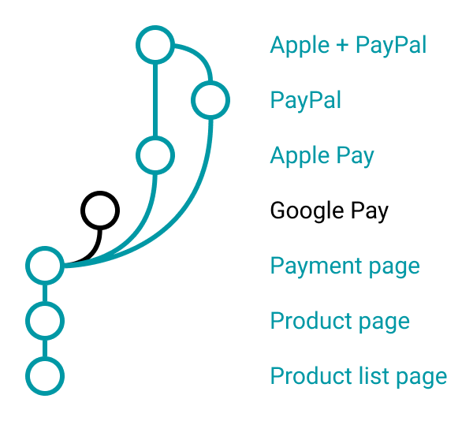
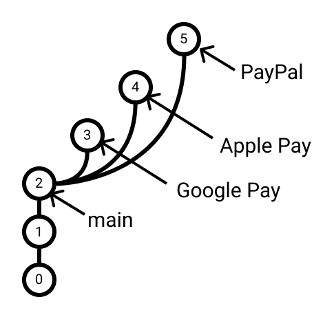
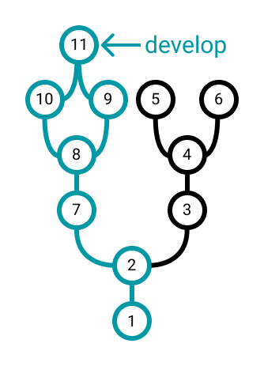

# 5.1 Vetvenie - Úvod

Jedným z príkladov, ktoré som uviedol v úvode a pre ktoré sa git oplatí používať je možnosť mať súbežne rozpracované
viaceré varianty nášho projektu. Napríklad chceme vyskúšať, ktorú metódu platby implementovať:

1. Platba cez Google Pay
2. Platba cez Apple Pay
3. Platba cez PayPal

Z jedného bodu v histórii by sme tak chceli spraviť 3 odbočky. Vyskúšať, ktorá z nich bude najlepšia a pokračovať tou
cestou. Ak by sme skutočne chceli vybrať len jednu platobnú metódu, naša história by mohla vyzerať nasledovne:

Ak by sme ale chceli z tohto výberu vybrať viacero možností, naša história by prezmenu mohla vyzerať nasledovne:

Odbočkám ukázaným vyššie hovoríme aj vetvy alebo **branch**-e.

Z našej histórie tak prestane vznikať jedna súvislá čiara, ale táto čiara sa vie rozkonáriť do viacerých vetiev.
Tieto vetvy môžeme následne celé presúvať, spájať alebo zahadzovať. Na vlastných priamočiarych projektoch to zrejme
nevyužiješ, ale akonáhle budeš pracovať s viacerými kolegami, vetvám sa nevyhneš.

## Čo sú vetvy
> **Dôležité:** Vetva `branch` je v podstate len pomenovaný "ukazovateľ" na nejaký commit.

V predchádzajúcom príklade by vetvy mohli vyzerať nasledovne:

Obvykle ale majú názvy bez veľkých písmen a prípadne používajú `/` pre zgrupovanie alebo `_` pre oddeľovanie slov.
Klasické názvy sú teda:

- `main` - obvyklý názov pre vetvu, ktorá obsahuje stabilnú verziu projektu. Všetky ostatné vetvy sú od nej závislé
- `develop` - vetva, ktorá obsahuje verziu projektu práve vo vývoji
- `feature/new-feature` - vetva, ktorá je tiež vo vývoji, ale týka sa konkrétnej funkcionality
- `bugfix/fix-bug` - vetva, ktorá rieši opravu chyby
- `release/v1.0.0` - vetva, ktorá obsahuje stabilnú verziu projektu

## Myšlienkový model

1. Študenti často nerozumejú tomu, že vetva je naozaj len ukazovateľ. Žiadna manipulácia s vetvou neovplyvní commity.
2. Na vetve sa commity v podstate nenachádzajú. Ak sa ale nachádzaš na vetve, tak sa nachádzaš na commite, ktorému predchádzajú iné commity.

Pozrime sa na vetvu `develop` v nasledujúcom diagrame:

Po odstránení vetvy `develop` stratíme ukazovateľ na commit `11`. Commit `11` stále existuje, ale keďže sa naň neodkazuje žiadna vetva, tak sa v gite priamo nezobrazí. Sú na to potrebné zvláštne operácie.

Pozri sa na commity označené zelenou farbou. Všetky tieto commity máš k dispozícii, keď sa nachádzaš na branch `develop`. Pre jednoduchú predstavu si predstav splachovací záchod. Kam všade sa po spláchnutí vetvy `develop` dostane voda?

> **Note:** Odstránením vetvy sa odstráni len ukazovateľ, commit v Gite stále zostáva, aj keď ho nemusíš vidieť.
