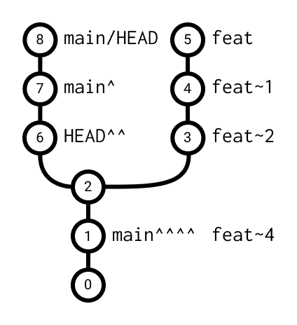

# 7.1 Navigácia v Git-e

Doteraz sme sa na konkrétne commity odkazovali buď menom vetvy (`main`), alebo jeho hashom (`aebabf5`). Commit hash
je ale ťažké zapamätať si a musíš ho vždy najprv nájsť pomocou `git log`. Git preto ponúka aj **relatívne** odkazy -
vieme povedať "commit pred týmto" alebo "commit spred troch commitov", bez toho aby sme poznali jeho hash.

## Pripomenutie - čo je `HEAD`?

Ako už vieme z lekcie o `git checkout`, **`HEAD`** je ukazovateľ, ktorý hovorí, na ktorom commite (a väčšinou aj na
ktorej vetve) sa práve nachádzame. Odkazy, ktoré si teraz ukážeme, sa dajú použiť nielen s `HEAD`, ale s
akýmkoľvek odkazom na commit - teda aj s vetvou (`main~1`) alebo s hashom (`aebabf5^`).

## Rodičia commitu

Každý commit (okrem toho prvého) má aspoň jedného **rodiča** - commit, ktorý mu predchádzal. Vo väčšine prípadov má
commit presne jedného rodiča. Výnimkou sú **merge commity** (spájanie vetiev), ktoré majú rodičov viacero - tým sa
budeme venovať neskôr.

## Operátor `^` - rodič commitu

Znak `^` za odkazom na commit znamená "**rodič tohto commitu**". Na ukážku použijeme príkaz `git show` (pozri
kapitolu `4.2`), ktorému namiesto konkrétneho commit hashu zadáme práve takýto relatívny odkaz.

```bash
git show HEAD^
```

Tento príkaz zobrazí commit, ktorý je priamym rodičom aktuálneho commitu (teda "o jeden commit dozadu"). Operátor
vieme aj reťaziť:

```bash
git show HEAD^^
```

`HEAD^^` znamená "rodič rodiča aktuálneho commitu" - teda commit spred dvoch krokov.

> **Note:** Pri merge commite (s viacerými rodičmi) vieme za `^` napísať aj číslo, napríklad `HEAD^2`, čím
> vyberieme **druhého** rodiča. Bez čísla (`HEAD^`) sa vždy myslí ten prvý.



## Operátor `~` - N-tý predok

Písanie `HEAD^^^^^` by bolo pri väčšom počte commitov nepraktické. Preto existuje skratka `~`, za ktorú napíšeme
rovno číslo - **počet commitov, o ktoré chceme ísť dozadu**.

```bash
git show HEAD~1
git show HEAD~2
git show HEAD~3
```

- `HEAD~1` je to isté ako `HEAD^` - priamy rodič
- `HEAD~2` je to isté ako `HEAD^^` - rodič rodiča
- `HEAD~3` je commit spred troch krokov

Ak číslo vynecháš, `HEAD~` sa správa rovnako ako `HEAD~1`.

> **Dôležité:** Rozdiel medzi `^` a `~` si zapamätaj takto - `~N` vždy ide **N krokov dozadu** po hlavnej vetve
> histórie. `^N` sa používa len vtedy, keď má commit **viacero rodičov** (merge commit) a potrebuješ si vybrať,
> ktorým smerom sa má Git pri "chodení dozadu" vydať.

## Praktické príklady

Tieto odkazy vieme použiť s takmer akýmkoľvek príkazom, ktorý pracuje s commitmi:

```bash
# Zobraz zmeny oproti predposlednému commitu
git diff HEAD~1

# Zobraz posledné 3 commity pred aktuálnym (bez aktuálneho)
git log HEAD~3..HEAD~1

# Presuň sa (v detached HEAD stave) na commit spred dvoch krokov
git checkout HEAD~2

# To isté, len s odkazom na vetvu namiesto HEAD
git show main~1
```

> **Tip:** Skús si v ľubovoľnom repozitári zavolať `git log --oneline` a následne `git show HEAD~1` alebo
> `git show HEAD^^` - hneď uvidíš, na ktorý presne commit sa odkaz odkazuje.
