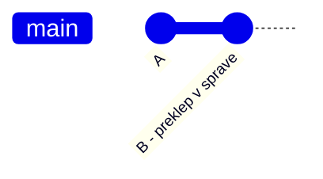
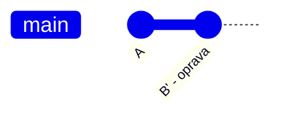

# 8.1 Git Commit --amend

Pri práci s Gitom jednoducho robíme chyby a väčšinou tieto chyby robíme v čerstvo uloženom commite. Stačí typo v
commit message, alebo len nájdeme nejakú drobnosť v našom kóde. Ak chyba vznikne v poslednom commite, môžeme ju
opraviť pomocou `git commit --amend`.

## Oprava commitu

```bash
git commit --amend -m "Nová správa"
```

Tento zápis má skoro presne ten istý význam ako `git commit -m "Nová správa"` ale

1. ak sme mali nejaké súbory v **staging area** pridajú sa do posledného commitu, čím zmenia jeho obsah
2. zároveň upraví aj commit message ma text `Nová správa`

## Use case - zmena správy posledného commitu

Ak sme sa pomýlili iba v správe commitu, stačí zavolať:

```bash
git commit --amend -m "Nová správa"
```

## Use case - zmena obsahu commitu

Ak si len zabudol pridať nejaký súbor do gitu, alebo si v nejakom súbore našiel chybu, tak nad týmto súborom zavolaj:

```bash
git add subor                 # pridanie zabudnutého/upraveného súboru
git commit --amend --no-edit  # zachovanie pôvodnej správy
```

> **Info:** Prepínač `--no-edit` hovorí Gitu, že chceš zachovať pôvodnú commit message a zmeniť iba obsah commitu.

## Čo sa deje "pod kapotou"?

`git commit --amend` v skutočnosti **nezmení** existujúci commit, ale vytvorí úplne **nový** commit (s novým hashom) a
presunie naň `HEAD` aj aktuálnu vetvu. Pôvodný commit ostáva v repozitári "zabudnutý", podobne, ako sme si to ukázali
pri mazaní vetvy.

Pred `--amend`:



Po `--amend`:



Commit `B` je nahradený úplne novým commitom `B'` s iným hashom - pôvodný `B` v histórii, na ktorú sa dá dostať
z vetvy, už nenájdeš.

## Varovanie

Amend prepisuje históriu, čo môže spôsobiť problémy, ak repozitár sledujú viacerí používatelia. Tento problém budeme
riešiť, keď budeme pracovať s GitHubom.
